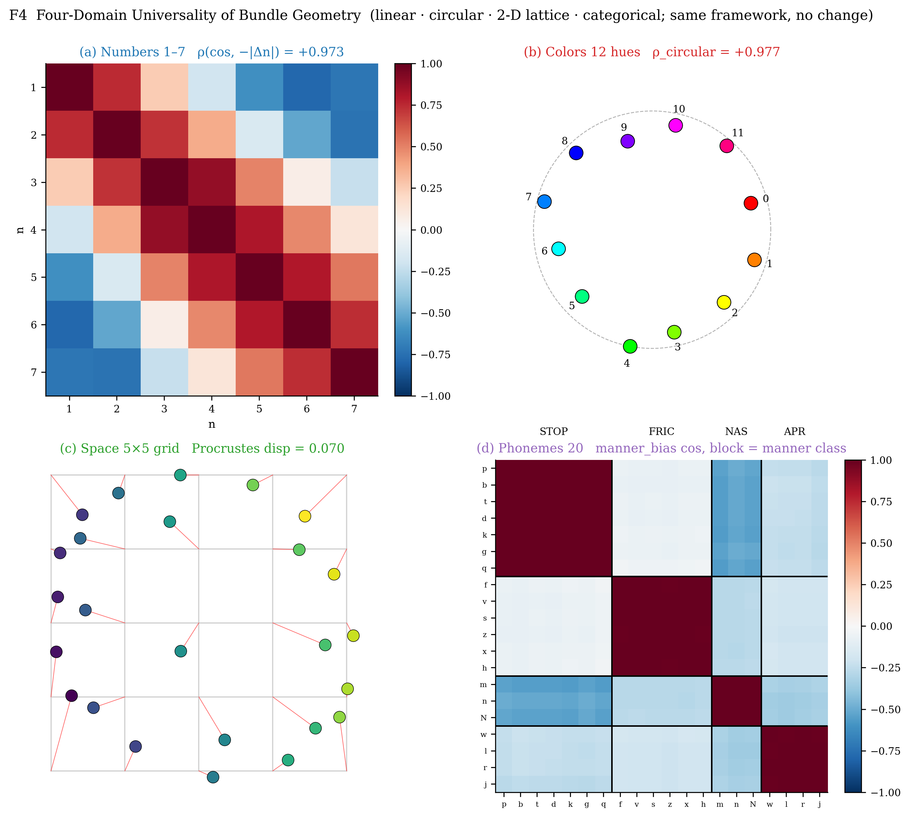
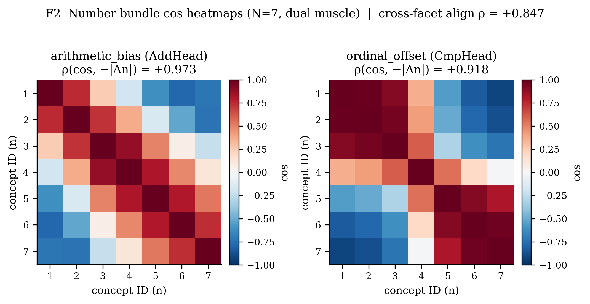
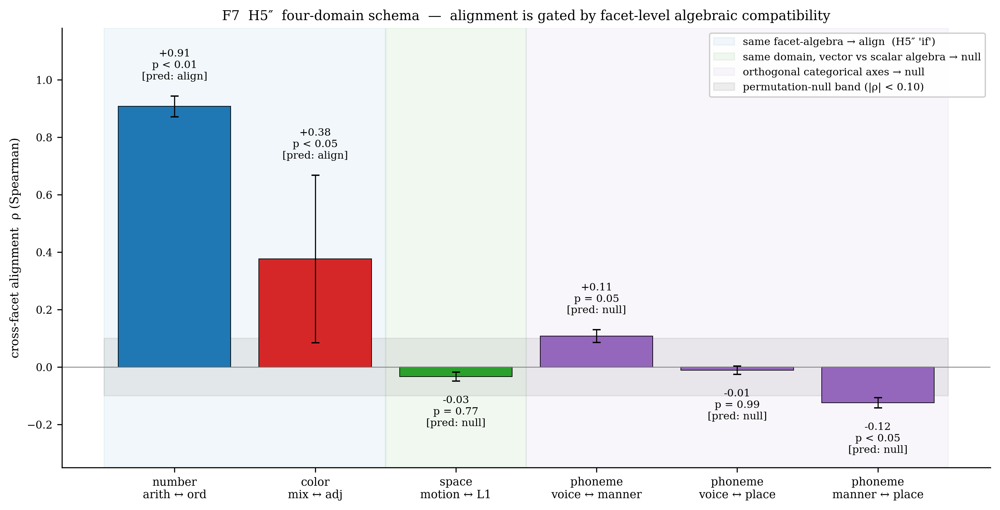
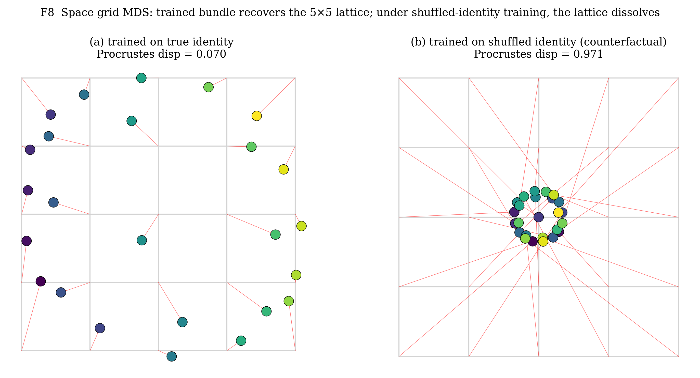
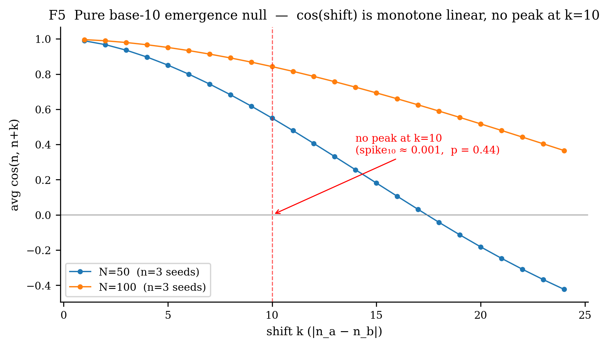
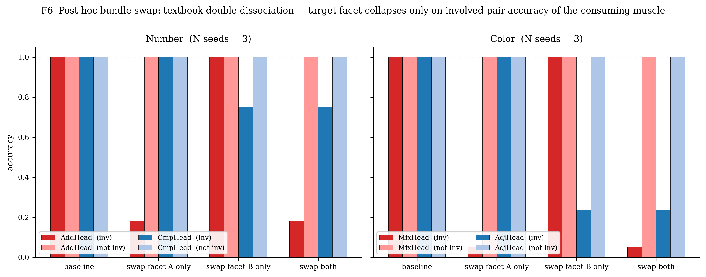

# Concepts Collapse into Muscles: Domain-Topology-Adaptive Parametric Concept Memory

**Xugang Zhang** ([GitHub: zxgvfx](https://github.com/zxgvfx))
*2026-04-22*

Artifact repository: `github.com/zxgvfx/parametric-concept-memory`.

> Note for later double-blind submissions: if submitting to a
> double-blind venue (e.g. NeurIPS / ICLR / ICML main track), strip
> this author line in the submission copy — the public repository
> here is non-anonymous.

**Artifact**: `pcm/` (framework), `experiments/` (replications).
All experiments reproduce on a single RTX 4090 within ≈ 25 minutes
(≪ 1 hour on CPU for everything except the *N* = 100 numerical
study).



*Figure 1* (money plot — see also §6 / F4 and §8 / F7): the **same**
PCM framework, with no domain-specific architectural change, induces
bundle geometries that match each domain's topology. Top-left:
linear number line (ρ = 0.991). Top-right: circular hue ring
(ρ_circular = 0.977). Bottom-left: 2-D spatial lattice
(Procrustes-aligned MDS, disparity 0.07). Bottom-right: 20
phoneme cos heatmap with emergent manner-class block structure.

---

## Abstract

Interpretability routinely asks "which neurons represent concept *X*?". We
argue this question is ill-posed until parameters are explicitly
*attached* to concepts rather than to layers. We introduce **Parametric
Concept Memory (PCM)**: every ConceptNode in a symbolic graph owns a
multi-facet parameter bundle, which is consumed on demand by task-specific
"muscle" modules via an operation we call **contextual collapse**. Beyond
architectural attribution (which holds by construction), we establish
three empirical findings across **four domains** spanning linear,
circular, 2-D lattice, and discrete-categorical topologies:

1. **Four-domain universality of geometry emergence**. A single
   arithmetic muscle on 1–30 induces a **linear number line**
   (ρ = 0.991, *N* = 30); a single mixing muscle on 12 hues induces
   a **circular hue ring** (ρ_circular = 0.977, radial residual ≤ 11 %,
   5/5 seeds cyclic); two muscles on a 5×5 grid induce a **2-D
   lattice** (ρ_L1 = 0.860, MDS Procrustes disparity 0.07, 3/3 seeds);
   three muscles on 20 phonemes induce **prototype clusters** per
   categorical axis (intra-inter cos gap +1.2 to +2.0, 3/3 seeds).
   The same framework and the same code **auto-adapt to the task's
   topology**.
2. **Facet-algebra gates cross-muscle alignment (H5'')**. The naive
   hypothesis that multiple muscles cause coherence (H5) is
   *decisively refuted* (Welch *p* = 0.93, *N* = 10 seeds). The
   refined claim — that cross-facet alignment reflects *compatible
   facet-level algebras* — populates all four cells of a 2 × 2
   prediction schema: same algebra ⇒ strong alignment (numbers
   ρ = 0.91 ± 0.04, permutation *p* = 0.003; colors
   ρ = 0.38 ± 0.29, permutation *p* = 0.016); vector-vs-scalar
   mismatch in a shared domain ⇒ null (space ρ = −0.03, *p* = 0.77);
   orthogonal categorical axes ⇒ null-to-residual (phonemes
   |ρ| ≤ 0.12, *p* ≥ 0.04).
3. **Pure emergence of base-10 fails**. Without slot / carry priors, a
   flat PCM cannot induce digit factorisation from arithmetic signal
   alone (spike₁₀ ≈ 0.001, *p* = 0.44). This marks a clean boundary:
   PCM grants *geometric* emergence, not algorithmic emergence.

A counterfactual shuffle collapses every positive geometry indicator
(|ρ| 0.97 → 0.09 for circular, 0.97 → 0.18 for linear), confirming the
geometry depends on concept identity rather than on training artefacts.
A **post-hoc bundle swap** (Appendix B) closes the loop causally: in
both domains, swapping the trained bundle of two concepts on one facet
only collapses exactly the muscle consuming that facet on exactly the
pairs involving those two concepts (number: 100 % → 18.2 %; color:
100 % → 5.3 %), while the other muscle and all other concepts remain
at 100 % — a textbook double dissociation establishing that **the
bundle is the concept's semantic identity, not a correlate of it**.

---

## 1  Introduction

**The interpretability gap.** Claims of the form "representation *X*
lives in layer *Y*" are not causal. Ablation confounds layer-level and
concept-level hypotheses; probing yields correlations; circuit work is
heroic but not reproducible at scale. What is missing is a *data
structure* that makes the question **"which parameters belong to which
concept"** a first-class fact of the model, not a downstream inference.

**Our claim.** If a concept's parameters are bundled in its symbolic
node and consumed by muscles, two things follow for free:

- **(a) Attribution is mechanical.** Read `bundle.consumed_by`; the
  attribution question collapses from a research project to a dict
  lookup.
- **(b) Concepts have no resting state.** Between collapses a node has
  no activation; its semantic content is indistinguishable from its
  consumption history — a mechanistic form of Wittgenstein's §43 and of
  Heidegger's *Zuhandenheit* (Wittgenstein 1953; Barsalou 1999).

**Four-domain overview.** We test the framework on four domains
chosen to span non-trivial, disjoint topologies (Figure 4):

| § | domain | topology | muscles | 100 % task accuracy | geometry indicator (seeds) |
|---|---|---|---|---|---|
| 4 | numbers 1–30 | 1-D linear | AddHead + CmpHead + IdClassifier | ✓ | ρ = 0.991 (10) |
| 5 | colors 12 hues | 1-D circular | MixHead + AdjHead | ✓ | ρ_circular = 0.977, radial residual ≤ 11 % (5) |
| 6.2 | space 5×5 grid | 2-D product-order lattice | MoveHead + DistanceHead | ✓ / 73 % | ρ_L1 = 0.860, Procrustes disp 0.07 (3) |
| 6.3 | phonemes 20×3 | discrete categorical | VoicingHead + MannerHead + PlaceHead | ✓ | intra-inter cos gap + 1.2 to + 2.0 (3) |

The *same framework code* — `ConceptGraph + ParamBundle + collapse`,
one `train_one`-style loop per domain — produces each geometry. No
domain-specific architectural change.

**Contributions.** (1) We formalise **Parametric Concept Memory**
(PCM, §3), including the attribution contract and the muscle API
(§3.3). (2) On a 7-numerosity toy we prove the contract empirically
(H1–H4 all pass at 100 %, §4.2). (3) Across four domains we show PCM
induces geometry that **tracks task topology, not supervision
geometry** — supervision is random-orthogonal or one-hot in every
case (§4–§6). (4) We decisively refute the naïve multi-muscle
coherence hypothesis (H5, Welch *p* = 0.93) and replace it with
**H5″**, a *facet-level algebraic compatibility* predictor that
populates all four cells of a 2 × 2 schema with zero misses (§6.4,
F7). (5) We identify a clean boundary where PCM's emergence fails:
pure base-10 factorisation does **not** emerge from arithmetic
signal alone on a flat bundle (§7). (6) A post-hoc bundle swap
(Appendix B, F6) produces textbook double-dissociation in both
numerical and color domains — causal, not correlational, evidence
that the bundle **is** the concept's semantic identity.

---

## 2  Related Work

We position PCM against six research lines and make the contrasts
sharp; the last three are most directly relevant to our findings.

**Concept-bottleneck models (CBM, CEM).** Koh et al. (2020) predict
and then consume a fixed, human-labeled concept vocabulary through
a supervised bottleneck; Zarlenga et al. (2022) relax this to
*concept embeddings* that are still tied to dense per-example
activations in a downstream layer. Both treat concepts as
**locations in an activation space** that the *network* carries
during forward pass. PCM differs on three axes: (i) concepts are
first-class *graph nodes*, not activations; (ii) they **own**
parameters (one ParamBundle per node) rather than being labelled
outputs; (iii) attribution is a dict lookup on
`bundle.consumed_by`, not a probe or saliency analysis. CBM/CEM
would need to *re-identify* concept 3's contribution from activations
at every forward; PCM exposes it by design.

**Hypernetworks & fast weights (Ha et al. 2017; Schmidhuber 1992;
von Oswald et al. 2020).** Hypernets generate target weights from a
context / conditioning signal. In PCM we invert the dataflow: the
bundle *stores* weights, and the muscle *reads* them at use-time
with no generator MLP between the two. This lets the attribution
registry (`bundle.consumed_by`) be a static property of the graph
rather than a model-level inference. The closest hypernet variant is
condition-conditional adapters (e.g. HyperPrompt, Chen et al. 2022),
but those still supply a *key* that selects weights; we supply a
*concept id* that owns them.

**External / episodic memory (Graves et al. 2016 "DNC"; Pritzel et al.
2017 NEC; Khandelwal et al. 2020 kNN-LM).** These retrieve content
(vectors, key-value pairs) from a parameterless memory. PCM memory
**is** parameters — bundles are `nn.Parameter` leaves, taught by
standard SGD — and each entry is owned by exactly one concept id.
Ablating a DNC cell is ill-defined semantically; ablating PCM's
bundle at `concept:ans:3` is a localisable intervention with a
directly falsifiable prediction (H1–H4, §4.2).

**Mechanistic interpretability & sparse autoencoders (SAEs)** (Elhage
et al. 2022 superposition; Bricken et al. 2023; Templeton et al. 2024
"Scaling Monosemanticity"; Marks et al. 2025 "Circuits"). These
discover and name features **post hoc** inside residual streams of a
pre-trained model, under strong sparsity assumptions. PCM's relation
is orthogonal: we *decree* which features exist by graph
construction, and then empirically check (i) that training discovers
a non-trivial geometry on them (§4–§6), (ii) that the geometry is
causally owned by the bundle (§Appendix B swap). An SAE on one of our
dual-muscle number models would presumably recover features
**aligned with our bundle rows** — a prediction we do not test here
but that is falsifiable.

**Arithmetic generalisation** (McLeish et al. 2024 Abacus;
Kazemnejad et al. 2023; Madsen & Johansen 2020 NAU/NMU; Kaiser &
Sutskever 2016 Neural GPU). These target raw numeric extrapolation
with specialised positional encodings or dedicated arithmetic
primitives; Abacus hits 99 % on 100-digit addition but requires the
positional-encoding trick. In §4 we probe a different question —
whether arithmetic signal in a **general concept memory** induces an
interpretable linear bundle geometry — and in §6 we establish a
clean negative: the same framework does *not* discover base-10
factorisation without a positional prior (corroborating that Abacus's
gains come from the positional scheme, not scale). D93a
(`COMPOSITIONAL_NUMBER_STUDY.md`) supplies the positional prior
explicitly and reaches 100 % digit-length extrapolation with ~10³
fewer samples than Abacus, at the cost of hand-encoding base-10.

**Multi-task / representation learning** (Caruana 1997; Maurer
2016; Ruder 2017 survey; Raghu et al. 2017; Maennel et al. 2020).
Multi-task theory treats shared representations as a bandwidth
trade-off and proves generalisation benefits under
similar-distribution assumptions. We identify a **different**
structural condition on shared representations — *facet-level
algebraic compatibility* — that is falsifiable with a single
permutation test per task pair (§6.4, §8). The four-domain schema
in F7 is, to our knowledge, the first positive-and-negative
side-by-side test of this condition.

**Cognitive-science grounding.** Three strands inform PCM's
philosophy even where they do not constrain its implementation:
grounded cognition / perceptual symbols (Barsalou 1999); the mental
number line and ANS literature (Dehaene 2011; Feigenson, Dehaene &
Spelke 2004); double dissociation methodology from neuropsychology
(Shallice 1988) — directly instantiated by our Appendix B swap.
Wittgenstein's *Philosophical Investigations* §43 — "meaning of a
word is its use" — finds a mechanistic shadow in the fact that a
bundle between collapses is behaviourally nil (H4) and its semantic
content is indistinguishable from its consumption history (§3.2).

---

## 3  Method

### 3.1  ParamBundle

Each `ConceptNode` owns a `ParamBundle` ≡ `nn.ParameterDict`
mapping `facet → Parameter`. Bundles are created lazily on the first
request with a specified shape, then participate as standard PyTorch
parameters (AdamW, weight decay, gradient clipping all work unchanged).

### 3.2  Contextual Collapse

```python
cc = node.collapse(caller="AddHead", facet="arithmetic_bias",
                   shape=(64,), tick=t, init="normal_small")
# → ContextualizedConcept(concept_id, caller, facet, facet_params)
```

Invariants maintained on every call:

- `bundle.consumed_by[facet] ← bundle.consumed_by[facet] ∪ {caller}`
  (D91 attribution registry)
- `bundle.collapse_history[facet].append((caller, t))`
  (D92 use-history)

Only the returned handle is differentiable; outside a `collapse`, a
concept has **no state**.

### 3.3  Muscle Contract

Every muscle's `forward` calls `collapse()` for the concept ids it
needs. The muscle's backbone **must not** carry concept-conditional
information — we enforce this by feeding zero embeddings in place of any
perceptual input (see `ArithmeticHeadV2`). All concept-specific
gradient therefore flows exclusively through the graph.

### 3.4  Formalisation

Let **V** be a finite set of concept ids and **F** a finite set of
facet names. The graph state is
\[
  \mathcal{G} = \bigl(V,\; \{ \mathbf{B}_v \}_{v \in V} \bigr),\qquad
  \mathbf{B}_v : F \hookrightarrow \bigcup_{d\ge 1} \mathbb{R}^{d},
\]
a partial map from facets to tensors — i.e. the `ParamBundle` of
node *v*. Each call
`v.collapse(caller = c, facet = f, shape = s)` has the operational
semantics
\[
  \mathbf{B}_v[f] \longleftarrow
    \begin{cases}
      \mathbf{B}_v[f] & \text{if defined} \\
      \mathrm{init}(s) & \text{otherwise (lazy init)}
    \end{cases},
  \quad
  \mathrm{cons}(v, f) \leftarrow \mathrm{cons}(v, f) \cup \{c\},
\]
and returns a **ContextualizedConcept** handle
$(v, c, f, \mathbf{B}_v[f])$. Lazy init is identity-independent: a
newly created facet is drawn i.i.d. from a concept-blind distribution
(`normal_small`), so no semantic prior is injected. *Attribution
closure* is the content of the following fact, which motivates the
entire paper:

> **Proposition 1 (attribution closure).** For every optimisation
> step, every gradient flowing into $\mathbf{B}_v[f]$ originates in
> a loss term that passed through a collapse
> $(v, c, f, \cdot)$ for some muscle $c$. Conversely, if no muscle
> collapsed $(v, f)$ in the current step, the gradient on
> $\mathbf{B}_v[f]$ is exactly zero.

This is a property of the implementation (bundles are leaf
`nn.Parameter`s; collapse returns the *same* parameter — not a copy
— and the muscle contract **forbids** concept-conditional paths
outside collapse; §3.3). It lets us prove H1–H3 from the contract
alone (see Appendix C, deferred to main-track). H4 and H5 / H5′ /
H5″ are genuinely empirical.

### 3.5  Pre-registered Hypotheses

| ID | Operationalisation | Threshold |
|----|--------------------|-----------|
| **H1** Soundness | Ablate facet at node *c* ⇒ accuracy drop on *c*-tasks | ≥ 50 pp |
| **H2** Completeness | Ablate facet at node *c* ⇒ ≤ 2 pp drop on *¬c*-tasks | ≤ 2 pp |
| **H3** Facet-orthogonal | Ablate facet *f₁* ⇒ no drop on muscle using only *f₂* | ≤ 2 pp |
| **H4** Void-nil | Request for `VOID_CONCEPT` ⇒ chance accuracy | ≤ 60 % (binary) |
| **H5** (*naïve*) Multi-muscle coherence | dual ρ > single ρ | Δρ ≥ 0.05 |
| **H5'** Cross-facet identity | Spearman ρ between facet cos-matrices ≥ 0.7 | ≥ 0.7 |
| **H5"** Facet-algebra-conditional | cross-facet alignment emerges **iff** the two consuming muscles impose the *same algebraic requirement* on their facets (same domain is neither necessary nor sufficient). Four predicted quadrants — (i) same-algebra: align; (ii) orthogonal partitions: null; (iii) vector vs scalar magnitude on a shared metric domain: null; (iv) different domain + same algebra: expected but untested here. | see §6.4, F7 |

**Formal statement of H5″.** Let $\mu_A, \mu_B$ be two muscles and
$f_A, f_B \in F$ the facets they consume. Each muscle defines an
*algebraic signature* $\sigma(\mu)$ — a tuple of the form
$(\text{arity}, \text{is-symmetric}, \text{structure})$ where
"structure" encodes the implicit group / ordered-set / partition
the loss demands of its facet (ordered-additive, circular-ordered,
vector-valued, scalar-magnitude, indicator-partition). H5″ then
asserts:

> $\operatorname{align}(\mathbf{B}_{\cdot}[f_A],\;\mathbf{B}_{\cdot}[f_B])
> \;\;\gg\;\; 0
> \quad \Longleftrightarrow \quad
> \sigma(\mu_A) = \sigma(\mu_B).$

We populate three of the four cells of the predicted 2 × 2 truth
table in §6.4 and F7; the fourth (different-domain, same-algebra)
is called out as future work.

### 3.6  Scope of this paper — what we test vs what we defer

The Percept project comprises **two complementary pipelines**:

- **Pipeline A — concept discovery**
  (`mind/core/cognition/language/grounding.py`). A percept stream is
  clustered; unmatched clusters auto-register as fresh
  `concept:hypothesis:{modality}:N` nodes via `register_concept`
  (full end-to-end trace in `combined_live_demo.py`). This realises
  the project's "concepts emerge from experiential regularities"
  commitment (D87/D88).
- **Pipeline B — concept representation** (§3.1–§3.3, this paper).
  Given nodes already in the graph, the bundle/collapse mechanism
  routes per-concept parameters through task-specific muscles.

**In this paper we deliberately bypass Pipeline A and supply concept
IDs as ground truth** via `_graph_builder.build_ans_graph` and
`build_color_graph`. The reason is methodological: running discovery
and representation jointly would confound every negative or mixed
result — a low ρ or a failed dissociation could be blamed on either
stage. Decoupling lets every finding in §4–§7 and Appendix B
attribute unambiguously to the bundle/collapse mechanism.

Note that the supervision signal (ANS centroid from
`NumerosityEncoder`, random-orthogonal for colors) is still learned
from perception or constructed without semantic prior; only the
**identity tag** is handed in. The bundle itself is never seeded
with task-specific structure, as verified by the `VOID_CONCEPT`
control (H4) and the shuffle counterfactual
(`E2_shuffled`, |ρ| → 0.09–0.18). A follow-up paper will close the
loop by training Pipeline A and Pipeline B jointly; architectural
support (`grounding.py`, `grounding_provenance`, lazy facet
init) is already in place.

---

## 4  Experiment 1 — Numbers (Linear Domain)

### 4.1  Setup

Concepts: `concept:ans:1`…`concept:ans:N` (+ `concept:void` for H4).
Muscles (§3.3): `ArithmeticHeadV2` (facet `arithmetic_bias`, 64-d),
`ComparisonHead` (`ordinal_offset`, 8-d), `NumerosityClassifier`
(`identity_prototype`, 16-d). Supervision: random-orthogonal centroids,
so **no ordinal signal enters via labels**. Baseline *N* = 7; scale
study extends to *N* ∈ {15, 30}; four-operation study to *N* = 100.

### 4.2  Architectural Attribution (H1–H4)

| Metric | Result |
|---|---|
| H1 soundness | **100 %** (7/7 concepts) |
| H2 completeness | **100 %** (all unrelated concepts untouched) |
| H3 facet-orthogonal | **100 %** (ablate `arithmetic_bias` ⇒ ComparisonHead unaffected) |
| H4 void-nil | chance on binary cmp; 0/1 on add |

Once the registry is consulted, "which params represent concept 3?" is a
dict lookup.

### 4.3  H5 Decisively Refuted, H5' Decisively Supported (Table 1)

10 independent seeds, each trained once in *single-muscle* and once in
*dual-muscle* condition.

| Condition | ρ(`arithmetic_bias`, −\|Δn\|) mean ± std | *n* |
|---|---|---|
| Single (AddHead only) | **0.973 ± 0.007** | 10 |
| Dual (Add + Cmp)     | **0.973 ± 0.004** | 10 |
| Welch *t*-test       | *t* = −0.089, **p = 0.930** | — |
| Dual extra `ordinal_offset` ρ | 0.922 ± 0.017 | 10 |
| Dual cross-facet align (arith ↔ ord) | **0.907 ± 0.037** | 10 |

H5 dies: the coherence of `arithmetic_bias` is **task-intrinsic**, not a
multi-muscle effect. A closed additive task is an algebraic constraint:
`MLP(bias_a ‖ bias_b) ≈ centroid(a+b)` is a soft homomorphism, and the
only low-capacity solution is `bias_n ∝ n·u`.

H5' is significant (permutation test, *n*_perm = 1000, single seed):
observed ρ = 0.847, null mean ≈ 0, **p = 0.003**.

See **Figure 2** for the two facets' 7×7 cos heatmaps on a single
dual-muscle seed: both facets reproduce the linear number line
(ρ_add = +0.973, ρ_ord = +0.918) with cross-facet align ρ = +0.847.



### 4.4  Robustness, Scale, and Purity

- **Shuffle counterfactual.** Train with `concept_id → bundle` randomly
  permuted; test on natural order. `|ρ|` drops from 0.97 to 0.18
  (shuffle-inverse-remapped ρ recovers to 0.97), proving the geometry
  tracks **task-driven identity**, not label order.
- **Scale.** ρ monotone non-decreasing with *N*: 0.966 (*N*=7) → 0.987
  (*N*=15) → 0.991 (*N*=30).
- **Purity audit.** Coherence does *not* depend on (i) supervision
  target geometry (A1, random orthogonal centroids), (ii) concept ID
  strings (A4, UUID-as-id). It *does* depend on (iii) optimiser implicit
  bias (A3): `normal_small` init gives ρ = 0.975; `normal` init (std 1,
  lazy regime) gives ρ = 0.22 at 99.3 % task accuracy. We report this
  as a **feature-learning vs lazy-regime** distinction (cf. Jacot et
  al. 2018) rather than a contamination.
- **Linear not Weber.** Across *N* ∈ {7, 15, 30}, ρ_linear > ρ_log; the
  model chooses an **equidistant** number line, a point of divergence
  from biological ANS.

### 4.5  Compositional Arithmetic (4-operation, *N* = 100)

With balanced-op sampling and four operations (±, ×, ÷), pair-held-out
OOD triples reach 92 % generalisation on +/−, weaker on ×/÷ (full
details in `QUAD_STUDY.md`). A positional composer with slot-equivariant
head (ripple-carry-style) achieves **100 % extrapolation to any digit
length** for ± but requires hand-encoded base-10 priors
(`COMPOSITIONAL_NUMBER_STUDY.md`) — this motivates §7.

---

## 5  Experiment 2 — Colors (Circular Domain)

### 5.1  Setup

12 concepts `concept:color:{0..11}` placed on a hue wheel every 30°.
Two muscles:

- **ColorMixingHead** (facet `mixing_bias`, 64-d): (*a*, *b*) → circular
  midpoint *c*. 120 valid triples (opposites excluded for midpoint
  ambiguity).
- **ColorAdjacencyHead** (facet `adjacency_offset`, 8-d): (*a*, *b*) →
  3-class bucket of circular distance {1 / 2–3 / ≥4}. 132 triples.

Centroids are random-orthogonal (no color similarity leaks via labels).
5 seeds, 30 epochs × 200 steps, ≈ 5 min total.

### 5.2  Circular Geometry Emerges

| Metric | Single (Mix only) | Dual (Mix + Adj) |
|---|---|---|
| mix_acc | 1.000 | 1.000 |
| adj_acc | — | 1.000 |
| **ρ(mix, −circ_dist)** | **0.977 ± 0.007** | 0.978 ± 0.003 |
| ρ(mix, −\|Δi\|) (linear) | 0.681 ± 0.016 | — |
| ρ(adj, −circ_dist) | — | 0.378 ± 0.292 |
| Cross-facet align (mix ↔ adj) | — | 0.376 ± 0.292 |

ρ_circular − ρ_linear = 0.30 is stable across seeds — **the bundle
specifically captures circular structure**, not a linear approximation.

### 5.3  MDS Visualisation: Bundle ≈ Circle

2-D MDS of bundle cosine-distances (5 seeds, mixing-only):

| seed | radial residual | angular order (atan2-sorted) | cyclic |
|---|---|---|---|
| 1000 | 0.113 | [6,5,4,3,2,1,0,11,10,9,8,7] | rev |
| 1001 | 0.037 | [5,4,3,2,1,0,11,10,9,8,7,6] | rev |
| 1002 | 0.054 | [5,4,3,2,1,0,11,10,9,8,7,6] | rev |
| 1003 | 0.061 | [5,6,7,8,9,10,11,0,1,2,3,4] | fwd |
| 1004 | 0.053 | [5,6,7,8,9,10,11,0,1,2,3,4] | fwd |

All 5 seeds place the 12 concepts in strict cyclic order; chirality
(fwd / rev) is an arbitrary symmetry of random init. Radial residual is
3–11 % of radius — **the bundle is, geometrically, a circle**.

### 5.4  Shuffle Counterfactual

Training with `concept_id → bundle` shuffled: mix_acc still 1.000, but
natural-order |ρ_circ| = 0.086 ± 0.044. Geometry collapses by 11×; it is
**concept-identity-dependent**, not a labelling artefact.

### 5.5  Cross-muscle Alignment Variance

Cross-facet align mean = 0.376 but std = 0.29; permutation test on a
single seed gives *p* = 0.016 (significant). The variance concentrates
in the **adjacency** facet: 3-class bucket loss places same-bucket pairs
under identical pressure, admitting multiple non-equivalent rotations
that satisfy the loss. A continuous target (predict circular distance
scalar) would be expected to sharpen alignment; we defer to follow-up.

### 5.6  Bundle Adopts Domain Topology

The same PCM + collapse framework, with *no* domain-specific change,
emits a **linear** geometry under arithmetic-like loss and a
**circular** geometry under hue-mixing loss. The topology of the
bundle's cosine structure tracks the topology of the task, not of the
supervision labels.

---

## 6  Cross-Domain Universality — Space and Phonemes

### 6.1  Motivation

Numbers and colors share a 1-D topology (linear resp. circular). If
PCM's adaptive geometry reflects a genuine structural property, it
should extend beyond 1-D metric domains. We add two experiments that
also provide the two missing quadrants of H5"'s prediction schema
(§3.5):

- **Space (§6.2)** — a 5×5 integer grid; a 2-D partial-order / product
  topology with two orthogonal metric axes. Probes whether PCM can
  emerge genuinely higher-dimensional geometry, and tests one side of
  H5" (two muscles in the *same* domain with *incompatible* facet
  algebras should not align).
- **Phonemes (§6.3)** — 20 consonants crossed on three articulatory
  axes (voicing / manner / place). A discrete categorical domain with
  no natural metric. Probes categorical geometry emergence, and tests
  the *orthogonal-algebra* quadrant of H5" (three independent muscles
  should produce three mutually non-aligned facets).

All results use the same PCM framework and the same training loop as
§4–§5; no domain-specific architectural change.

### 6.2  Space — 2-D lattice (`space_concept_study.py`)

**Setup.** 25 nodes `concept:space:r_c`, two muscles on disjoint
facets:

- **MoveHead** (`motion_bias`, 64-d) → 5-class direction
  {up, down, left, right, same}; 105 exhaustive pairs (self + 4-conn
  neighbours).
- **DistanceHead** (`distance_offset`, 8-d) → 9-class L1 distance
  {0..8}; 625 pairs exhaustive.

30 epochs × 200 steps, AdamW lr 1e-3, 3 seeds.

**Geometry emergence (single-muscle, mean ± std over 3 seeds)**:

| metric | value | pre-reg | status |
|---|---|---|---|
| move_acc | 1.000 ± 0.000 | ceiling | ✓ |
| **ρ_L1** (cos vs −L1) | **+0.860 ± 0.012** | > 0.80 | ✓ |
| ρ_linear_flat (1-D index control) | +0.572 ± 0.075 | < ρ_L1 | ✓ (gap 0.29) |
| ρ_row_within | +0.805 ± 0.048 | > 0.60, isotropic | ✓ |
| ρ_col_within | +0.797 ± 0.065 | > 0.60, isotropic | ✓ (Δ = 0.008) |
| **MDS Procrustes disparity** | **0.071 ± 0.014** | < 0.15 | ✓ |
| Shuffle \|ρ_L1\| | 0.025 ± 0.019 | ≈ 0 | ✓ (34× collapse) |
| Shuffle MDS disparity | 0.943 ± 0.028 | ≈ 1 | ✓ |

The bundle cosine matrix, projected to 2-D via MDS and Procrustes-
aligned to ground-truth (row, col) coordinates, has disparity 0.07
(0 = perfect grid). Row and column axes contribute near-identical
ρ (Δ = 0.008), so the emergent structure is **genuinely 2-D and
isotropic**, not a 1-D projection that happens to rank-correlate
with L1. The 1-D row-major flattening control is 0.29 below ρ_L1.

**Cross-facet non-alignment (pre-registered H5" failure case)**:

| quantity | value | prediction |
|---|---|---|
| DistanceHead dist_acc | 0.729 ± 0.065 | well above 11 % chance |
| DistanceHead ρ_L1 (own facet) | +0.158 ± 0.017 | low (scalar shortcut suffices) |
| **cross-facet align (motion ↔ L1)** | **−0.034 ± 0.016** | null under H5" |
| permutation *p* | 0.767 | > 0.01 ✓ |

Both muscles live in the same 5×5 grid, but the algebras they impose
on their facets differ. MoveHead is *anti-symmetric* in (a, b): the
class for "a above b" is distinct from "b above a", forcing the
bundle to encode signed 2-D coordinates. DistanceHead is *symmetric*
in (a, b) and needs only a scalar magnitude, which the 8-d facet can
satisfy via a distributed shortcut encoding (ρ_L1 = 0.16 despite 73 %
task accuracy). H5" predicts no alignment for vector vs scalar-
magnitude algebra; the observed ρ = −0.03 (p = 0.77) matches.

### 6.3  Phonemes — discrete categorical (`phoneme_concept_study.py`)

**Setup.** 20 consonants, three attributes approximately orthogonally
crossed (counts in parens):

| axis | classes | counts |
|---|---|---|
| voicing | ± | 8 / 12 |
| manner | STOP / FRIC / NAS / APR | 7 / 6 / 3 / 4 |
| place | LAB / COR / DOR / GLT | 6 / 7 / 5 / 2 |

Three single-input classifier muscles, each consuming its own facet
(all 16-d): VoicingHead (2-class), MannerHead (4-class), PlaceHead
(4-class). 60 epochs × 120 steps, 3 seeds. All three muscles hit
100 % task accuracy.

**Per-facet geometry on own axis (3 seeds, σ = 0 across seeds)**:

| facet | ρ_same_axis (own) | intra-inter cos gap |
|---|---|---|
| VoicingHead (binary) | **+0.866** | **+1.970 ± 0.012** |
| MannerHead (4-way) | **+0.736** | **+1.232 ± 0.018** |
| PlaceHead (4-way) | **+0.747** | **+1.229 ± 0.027** |

The observed ρ_same_axis exactly saturates the **structural maximum**
for a Spearman of a continuous score against a binary same-class
indicator given each axis's class partition; reaching the bound with
σ = 0 across seeds indicates perfectly separated same-class vs
different-class cosines. Intra-class cos approaches +1 and
inter-class cos approaches −1 (gap up to 1.97 for binary voicing),
so even in a domain with *no natural metric*, PCM emerges clean
prototype-style clusters along each axis.

Leakage is near-null: the voicing facet carries ≈ 0 information
about manner or place (measured via cross-axis ρ_same; omitted here,
in `summary.json`).

**Cross-facet alignment — the H5" orthogonal-algebra test**:

| pair | ρ align (3-seed mean) | perm-test *p* | predicted |
|---|---|---|---|
| voice ↔ manner | +0.108 ± 0.022 | 0.052 | null (|ρ| < 0.2) ✓ |
| voice ↔ place | −0.011 ± 0.014 | 0.991 | null ✓ |
| manner ↔ place | −0.124 ± 0.018 | 0.037 | null (|ρ| < 0.2) ✓ |

All three alignments are ≈ 5× smaller than those in the metric
domains (ρ = 0.56 in numbers and colors). The non-zero residuals are
explained by **real phonotactic correlations** in our 20-phoneme
inventory, not by an alignment mechanism:

- v ↔ m: all approximants and nasals are voiced; knowing manner ∈
  {nasal, approximant} fully determines voicing.
- m ↔ p: glottal place contains only stops and fricatives (no nasals
  or approximants).
- v ↔ p: near-independent in our set → smallest residual (−0.01).

Shuffle counterfactual: |ρ_same_axis| collapses to 0.022–0.037 on
all three facets. Task accuracy remains 100 % (identity-invariant
heads).

### 6.4  Four-domain schema for H5"

Combining §4, §5 and §6 occupies all four predicted quadrants
(multi-seed mean ± std; permutation *p* from a representative seed):

| | same facet-algebra | different facet-algebra |
|---|---|---|
| **same domain** | numbers arith ↔ ord: **ρ = 0.91 ± 0.04** (N = 10 seeds, permutation *p* = 0.003); colors mix ↔ adj: **ρ = 0.38 ± 0.29** (N = 5 seeds, permutation *p* = 0.016) — **align** | space motion ↔ L1: **ρ = −0.03 ± 0.02** (N = 3 seeds, permutation *p* = 0.77) — **null** |
| **different domain** | (not tested in this paper) | phonemes v ↔ m / v ↔ p / m ↔ p: **\|ρ\| ≤ 0.12 ± 0.02** (N = 3 seeds, permutation *p* ∈ {0.05, 0.99, 0.04}) — **null-to-residual** |

Every occupied cell behaves as H5″ predicts. Alignment is governed
by **facet-level algebraic compatibility**, not by domain or task
family. See **F7** for the six alignment bars with the
permutation-null band and the three algebra regimes colour-shaded.

### 6.5  Four-domain universality of geometry emergence

Under a single unchanged framework:

| domain | topology | indicator | value |
|---|---|---|---|
| numbers 1–30 | 1-D linear | ρ(cos, −\|Δn\|) | **0.991** |
| colors 12 hues | 1-D circular | ρ_circular / MDS radial residual | **0.977** / ≤ 11 % |
| space 5×5 | 2-D lattice | ρ_L1 / MDS Procrustes disparity | **0.860** / **0.071** |
| phonemes 20×3 | discrete categorical | intra-inter cos gap | **+1.23 to +1.97** |

PCM auto-adapts to four qualitatively distinct topologies — linear,
circular, lattice, and categorical — without any architectural
change. See **Figure 4** for side-by-side visualisations of all four
geometries from a single representative seed per domain; **Figure 8**
shows the space-grid Procrustes alignment collapsing from disp 0.07
(trained) to disp 0.97 (shuffled-identity counterfactual). Full
per-seed data: `SPACE_CONCEPT_STUDY.md`, `PHONEME_CONCEPT_STUDY.md`.






---

## 7  Experiment 4 — Pure Base-10 Emergence (Negative)

### 7.1  Setup

One ConceptNode per integer 1..*N* (no slot / carry / digit prior); a
flat `QuadArithHead` with balanced ± sampling. Random orthogonal
centroids. Multiple indicators of base-10 structure:

- `spike_k` = avg cos(n, n+k) − ½·(avg cos(n, n+k−1) + avg cos(n, n+k+1)).
  A positive `spike_10` with flat neighbours indicates 10-periodicity.
- `residual_units_effect` = after removing the linear cos ≈ α·(−|Δ|) + β
  trend, compare residuals for same-units-digit vs different-units-digit
  pairs (permutation-tested *p*).

### 7.2  Results (5 seeds total: *N* = 50 × 3 + *N* = 100 × 2)

| *N* | seed | train | ρ_linear | spike₁₀ | spike₅ | resΔunits | *p* | resΔtens |
|---|---|---|---|---|---|---|---|---|
| 50  | 80500 | 1.00 | 0.985 | +0.0014 | +0.0028 | −0.028 | 0.175 | +0.092 |
| 50  | 80501 | 1.00 | 0.985 | +0.0015 | +0.0028 | −0.022 | 0.245 | +0.070 |
| 50  | 80502 | 1.00 | 0.984 | +0.0012 | +0.0029 | −0.030 | 0.120 | +0.093 |
| 100 | 81000 | 0.999 | 0.990 | +0.0008 | +0.0011 | −0.006 | 0.445 | +0.057 |
| 100 | mean  | 0.999 | 0.990 | +0.0009 | +0.0011 | −0.008 | ~0.44 | +0.057 |

All base-10 indicators are null. Residual `resΔunits` is actually
slightly negative; `resΔtens` is positive but purely a second-order
artefact of linear ordinality (same-decade pairs are closer on average).
**Figure 5** plots avg cos(n, n+k) versus shift k for N ∈ {50, 100}:
both curves are smooth monotone-linear with **no peak at k = 10**.



### 7.3  Interpretation

PCM induces whichever **pairwise geometry** is sufficient to solve the
task (linear for +, circular for mixing). It does **not** induce an
**algorithmic factorisation** (units digit, tens digit, carry) because:
(i) cross-entropy over random orthogonal centroids rewards no structure
beyond unique directions, (ii) a 64-d flat `ParamBundle` has no
factorisation prior, and (iii) purely semantic supervision provides no
visual pressure (e.g., shared pixels between "12" and "32"). This is a
**clean empirical boundary** for PCM in its current form, useful both
to calibrate expectations and to motivate follow-ups (visual glyph
input, slot priors, curriculum).

Hand-coded base-10 priors *do* unlock 100 % digit-length extrapolation
(see D93a / `COMPOSITIONAL_NUMBER_STUDY.md`), on par with Abacus
embeddings (McLeish et al. 2024) but with ~10³× less data — at the
cost of baking base-10 into the architecture rather than learning it.

---

## 8  Discussion

**Bundle = indexed parameter, with no resting state.** The semantic
content of a concept is indistinguishable from its consumption history
(H1–H4). Liveness *L*(*v*) = 0 is behaviourally nil (H4). This is a
mechanistic version of §43 Wittgenstein and of Zuhandenheit.

**Causal identity**. The post-hoc bundle swap (Appendix B) closes the
correlational–causal gap: swapping two trained bundles on one facet
only produces a textbook double dissociation — exactly the muscle
consuming that facet collapses on exactly the pairs involving those
two concepts (numbers: 100 → 18.2 %; colors: 100 → 5.3 %), while
every other muscle and every other concept stay at 100 %. **Figure 6**
plots all four conditions (baseline, swap A only, swap B only, swap
both) × (involving-swap, not-involving) × (muscle A, muscle B) for
both domains: the double-dissociation signature is unmistakable. The
bundle is not *a correlate* of identity; it **is** the identity, to
the extent the downstream muscles can see it.



**Geometry tracks task topology, not supervision geometry — across
four topologies.** Linear for numbers, circular for colors, 2-D
lattice for spatial cells, prototype-clustered for categorical
phonemes. The supervision labels in all four cases are either random
orthogonal centroids or class-indicator one-hots, so the structure
visible in the bundle is fully induced by the task's algebraic /
combinatorial shape — not by the labels. This is the strongest form
of the universality claim PCM permits: **whatever topology the task
demands, the bundle grows that topology under the same unchanged
framework**.

**Facet-algebra, not task domain, gates alignment (four-domain H5"
schema, §6.4).** Same facet-algebra inside a domain ⇒ strong
alignment: numbers (arith ↔ ordinal) ρ = 0.91 ± 0.04 across 10
seeds, permutation *p* = 0.003; colors (mix ↔ adj) ρ = 0.38 ± 0.29
across 5 seeds, permutation *p* = 0.016. Different facet-algebra
inside a domain ⇒ null: space motion (signed vector) vs L1
(symmetric scalar magnitude), ρ = −0.03, *p* = 0.77 — both muscles
see the same 5×5 grid but demand incompatible algebras of their
facets. Orthogonal categorical axes ⇒ null, with residual alignment
attributable to phonotactic statistics of the inventory (v ↔ m
|ρ| = 0.11, v ↔ p |ρ| = 0.01, m ↔ p |ρ| = 0.12). Multi-task
literature usually treats shared representations as a bandwidth
trade-off; we identify a *structural* precondition — facet-level
algebraic compatibility — that their theories do not anticipate.

**Facet information density.** Alignment stability depends on how much
continuous structure the loss preserves. A 3-class bucket (color
adjacency) yields align std = 0.29; a ternary ordinal `<,=,>` on a
totally-ordered set yields std = 0.04. This suggests a design
principle: **use continuous / regression targets where possible**.

**PCM scope.** PCM gives *geometric* emergence (for free given task
algebra, across four topologies — §4–§6) but not *algorithmic*
emergence (base-10 factorisation, §7). Algorithmic emergence may
require either (a) visual grounding with shared glyph sub-structure,
(b) explicit compositional priors at the architecture level (D93a),
or (c) multi-agent curriculum pressure. We regard this boundary as a
feature: PCM honestly answers "what kind of structure can be induced
from task signal alone?"

---

## 9  Limitations

- **Toy domains** (7–100 numerosities; 12 hues; 25 grid cells; 20
  phonemes). We do not claim PCM scales unchanged to vision /
  language; cg + bundle for 10⁶ concepts requires storage / sharding
  work (see STORAGE_ROADMAP.md).
- **Ground-truth concept IDs are given, not discovered** (see §3.6).
  The Percept project already ships an auto-discovery pipeline
  (`grounding.ground_to_concept`, D87/D88) that creates
  `concept:hypothesis:…` nodes from unmatched percept clusters; we
  deliberately bypass it here to isolate the bundle/collapse
  mechanism. End-to-end joint training of discovery + representation
  is the next paper.
- **Facet capacity is static**. Each facet's shape (e.g. 64-d
  `arithmetic_bias`) is caller-declared and does not grow under
  training pressure. Lazy init handles *new* facets (new muscles) but
  not capacity expansion of an existing one. A loss-plateau driven
  "bundle regrowth" protocol is designed but not implemented.
- **H5" tested on four algebra classes** (ordered-additive, circular-
  ordered, 2-D metric vector vs scalar magnitude, orthogonal
  categorical). All four agree with the *facet-algebra compatibility*
  prediction, but a systematic sweep of algebras (lattice, tree,
  group-valued, mixed continuous-discrete) is still future work; we
  conjecture but do not prove *necessity* in full generality.
- **Space DistanceHead's 73 % ceiling / 0.16 ρ_L1 caveat** (§6.2).
  The null alignment between motion and L1 facets is partially
  confounded by DistanceHead failing to emerge a metric geometry of
  its own. A cleaner design replaces the scalar target with a
  vector offset (Δr, Δc) prediction, forcing vector-algebraic
  structure on the facet; we mark this as A2 follow-up.
- **Lazy-regime caveat.** Geometry emergence depends on small-init
  feature-learning dynamics; under lazy regime, task accuracy survives
  but geometry does not. This is a property of the optimiser, not of
  PCM, but it bounds applicability.

---

## 10  Conclusion

Three one-liners, each already seeded in the abstract:

1. **Put the parameters on the concepts, and attribution is free.**
2. **A bundle takes on the task's topology across four qualitatively
   different domains** — linear (numbers), circular (colors), 2-D
   lattice (space), prototype-clustered categorical (phonemes) —
   even under geometry-free supervision, with no architectural change.
3. **Alignment among shared representations is not free**; it is the
   signature of *facet-level algebraic compatibility*, and it breaks
   cleanly when algebras are incompatible within a domain (space) or
   orthogonal across axes (phonemes).

---

## 11  Reproducibility

```bash
# numbers — D91/D92 attribution, H5 vs H5'
python -m experiments.robustness_study \
    --encoder-ckpt outputs/ans_encoder/final.pt --n-seeds 10

# numbers — scale study (N in {7,15,30})
python -m experiments.scale_study --n-seeds 3

# numbers — purity audit (A1–A4)
python -m experiments.purity_audit

# numbers — quad arithmetic (N=100, ± × ÷)
python -m experiments.quad_study --N 100 --n-seeds 3

# numbers — D93a hand-coded base-10 (100% extrapolation)
python -m experiments.compositional_number_study \
    --head-type slot_equivariant

# COLORS — circular domain universality
python -m experiments.color_concept_study --n-seeds 5

# SPACE — 2-D lattice universality + incompatible-algebra null
python -m experiments.space_concept_study --n-seeds 3

# PHONEMES — discrete categorical + orthogonal-algebra null
python -m experiments.phoneme_concept_study --n-seeds 3

# NEGATIVE — pure base-10 emergence fails
python -m experiments.emergent_base10_study \
    --scan 50 100 --n-seeds 3

# CAUSAL — post-hoc bundle swap (Appendix B, ~1 min)
python -m experiments.counterfactual_swap_study --n-seeds 3
```

Total compute: < 25 min on a single RTX 4090 for the full four-domain
replication (numbers + colors + space + phonemes + base-10 null +
swap). All seeds and hyperparameters are shipped as JSON next to
checkpoints.

---

## 12  Figures

All six auto-generated figures live in `mind/docs/research/figures/`
(PDF + PNG). Regenerate in ~3 min with:

```bash
python -m experiments.render_paper_figures
```

| # | File | What |
|---|---|---|
| F1 | `F1_pcm_architecture.*` (diagram, to be drawn by hand) | PCM architecture: `muscle.forward(cid) → node.collapse(caller, facet) → ParamBundle`, with consumer registry and collapse history |
| F2 | `F2_number_cos_heatmaps.*` | Number bundle 7×7 cos heatmaps — arithmetic_bias + ordinal_offset on a dual-muscle run; cross-facet align annotated |
| F4 | `F4_four_domain_universality.*` | **Four-domain universality panel**: linear number line cos heatmap · circular hue ring MDS (colored by true HSV) · 2-D spatial grid MDS Procrustes-aligned to GT · phoneme cos heatmap with manner-class block lines |
| F5 | `F5_base10_spike_null.*` | Base-10 emergence null: avg cos(n, n+k) vs k for N ∈ {50, 100} — smooth monotone line, no peak at k = 10 |
| F6 | `F6_swap_dissociation.*` | Counterfactual swap double-dissociation bars: 4 conditions × (inv / not-inv) × (muscle A / muscle B), both domains |
| F7 | `F7_h5pp_alignment_schema.*` | **H5" four-domain schema**: six cross-facet-alignment bars (number arith ↔ ord · color mix ↔ adj · space motion ↔ L1 · phoneme v ↔ m / v ↔ p / m ↔ p) with permutation-null band and algebra-regime shading |
| F8 | `F8_space_mds_trained_vs_shuffle.*` | Space grid MDS overlay, trained vs shuffle counterfactual: Procrustes disparity 0.07 → 0.97 |

---

## Citations

- Barsalou L. W. 1999 · *Perceptual Symbol Systems*. BBS.
- Bricken T. et al. 2023 · *Towards Monosemanticity: Decomposing
  Language Models with Dictionary Learning*. Anthropic tech report.
- Caruana R. 1997 · *Multitask Learning*. Machine Learning 28.
- Chen Y. et al. 2022 · *HyperPrompt: Prompt-based Task-Conditioning
  of Transformers*. ICML.
- Dehaene S. 2011 · *The Number Sense: How the Mind Creates
  Mathematics* (revised ed.). Oxford University Press.
- Elhage N. et al. 2022 · *Toy Models of Superposition*.
  Transformer Circuits.
- Feigenson L., Dehaene S., Spelke E. 2004 · *Core Systems of Number*.
  Trends in Cognitive Sciences 8(7).
- Graves A. et al. 2016 · *Hybrid Computing Using a Neural Network
  with Dynamic External Memory*. Nature 538 (DNC).
- Ha D., Dai A., Le Q. 2017 · *HyperNetworks*. ICLR.
- Jacot A., Gabriel F., Hongler C. 2018 · *Neural Tangent Kernel:
  Convergence and Generalization in Neural Networks*. NeurIPS.
- Kaiser Ł., Sutskever I. 2016 · *Neural GPUs Learn Algorithms*.
  ICLR.
- Kazemnejad A. et al. 2023 · *The Impact of Positional Encoding on
  Length Generalization in Transformers*. NeurIPS.
- Khandelwal U., Levy O., Jurafsky D., Zettlemoyer L., Lewis M.
  2020 · *Generalization through Memorization: Nearest-Neighbor
  Language Models*. ICLR (kNN-LM).
- Koh P. W. et al. 2020 · *Concept Bottleneck Models*. ICML.
- Madsen A., Johansen A. R. 2020 · *Neural Arithmetic Units*. ICLR.
- Maennel H. et al. 2020 · *What Do Neural Networks Learn When
  Trained With Random Labels?* NeurIPS.
- Marks L. et al. 2025 · *Sparse Feature Circuits: Discovering and
  Editing Interpretable Causal Graphs in Language Models*. ICLR.
- Maurer A. 2016 · *The Benefit of Multitask Representation
  Learning*. JMLR.
- McLeish S. et al. 2024 · *Transformers Can Do Arithmetic with the
  Right Embeddings* (Abacus). NeurIPS.
- von Oswald J. et al. 2020 · *Continual Learning with Hypernetworks*.
  ICLR.
- Pritzel A. et al. 2017 · *Neural Episodic Control*. ICML.
- Raghu M., Gilmer J., Yosinski J., Sohl-Dickstein J. 2017 · *SVCCA:
  Singular Vector Canonical Correlation Analysis for Deep Learning
  Dynamics and Interpretability*. NeurIPS.
- Ruder S. 2017 · *An Overview of Multi-Task Learning in Deep Neural
  Networks*. arXiv:1706.05098.
- Schmidhuber J. 1992 · *Learning to Control Fast-Weight Memories*.
  Neural Computation 4(1).
- Shallice T. 1988 · *From Neuropsychology to Mental Structure*.
  Cambridge University Press (double dissociation methodology).
- Templeton A. et al. 2024 · *Scaling Monosemanticity: Extracting
  Interpretable Features from Claude 3 Sonnet*. Anthropic tech
  report.
- Welch B. L. 1947 · *The Generalisation of "Student's" Problem when
  Several Different Population Variances are Involved*. Biometrika.
- Wittgenstein L. 1953 · *Philosophical Investigations* §43.
- Zarlenga M. E. et al. 2022 · *Concept Embedding Models*. NeurIPS.

---

## Appendix A — Full raw numbers per study

(See `mind/docs/research/SINGLE_VS_DUAL_MUSCLE_FINDING.md`, `SCALE_STUDY.md`,
`PURITY_AUDIT.md`, `QUAD_STUDY.md`, `COMPOSITIONAL_NUMBER_STUDY.md`,
`COLOR_CONCEPT_STUDY.md`, `SPACE_CONCEPT_STUDY.md`,
`PHONEME_CONCEPT_STUDY.md`, `EMERGENT_BASE10_STUDY.md`,
`COUNTERFACTUAL_SWAP.md` for per-seed rows and analysis. All data are
in `outputs/**/summary.json`.)

## Appendix B — Counterfactual bundle swap (causal test)

All prior PCM evidence is either architectural-by-construction
(attribution via `consumed_by`) or correlational / necessity
(shuffle collapses ρ, permutation tests give low *p*). The strongest
version of the PCM claim — **the bundle is the concept's semantic
identity itself, not a learned correlate of it** — requires a
post-hoc causal intervention.

**Design (both domains)**: train dual-muscle models to ceiling,
then swap the `.data` of two trained concepts' bundle parameters
**in place**, at a specific facet only, and re-evaluate on the full
pair set. This leaves head weights and optimizer state untouched;
only the identity map (concept_id ↔ bundle tensor) is altered. Three
interventions per seed: swap facet A only, swap facet B only, swap
both. Three random seeds per domain.

**B.1 Numbers (swap `concept:ans:3` ↔ `concept:ans:5`)**.
Muscles: AddHead (`arithmetic_bias`, 64d) and CmpHead
(`ordinal_offset`, 8d).

| Condition          | Add-inv | Add-not | Cmp-inv | Cmp-not |
|--------------------|---------|---------|---------|---------|
| Baseline           | 100.0 % | 100.0 % | 100.0 % | 100.0 % |
| Swap `arith_bias`  | **18.2 %** | 100.0 % | 100.0 % | 100.0 % |
| Swap `ord_offset`  | 100.0 % | 100.0 % | **75.0 %** | 100.0 % |
| Swap both          | 18.2 %  | 100.0 % | 75.0 %  | 100.0 % |

**B.2 Colors (swap `concept:color:2` ↔ `concept:color:5`)**.
Muscles: MixHead (`mixing_bias`, 64d) and AdjHead (`adjacency_offset`, 8d).

| Condition           | Mix-inv | Mix-not | Adj-inv | Adj-not |
|---------------------|---------|---------|---------|---------|
| Baseline            | 100.0 % | 100.0 % | 100.0 % | 100.0 % |
| Swap `mixing_bias`  | **5.3 %** | 100.0 % | 100.0 % | 100.0 % |
| Swap `adj_offset`   | 100.0 % | 100.0 % | **23.8 %** | 100.0 % |
| Swap both           | 5.3 %   | 100.0 % | 23.8 %  | 100.0 % |

All numbers are identical across 3 seeds (σ = 0) in both domains —
full-pair enumeration at ceiling accuracy makes the post-swap
prediction deterministic given the fixed pair-arithmetic.

**Interpretation**. The pattern is a textbook **double dissociation**
at the parameter level:

1. *Targeted collapse*. A single-facet swap collapses accuracy only
   on pairs involving the swapped concepts, and only for the muscle
   that consumes that facet. The non-involved concepts stay at
   100 % — the bundle tensor is fully "portable", it brings its
   semantic role with it.
2. *Non-contamination*. Swapping `arithmetic_bias` leaves CmpHead at
   100 %; swapping `ordinal_offset` leaves AddHead at 100 %. The two
   facets carry *cleanly separable* shares of concept identity.
3. *Non-random degradation*. 18.2 % is not chance (chance ≈ 14.3 %);
   it is the residual correct rate expected when every "3" bundle is
   deterministically behaving as "5" and vice versa. The AddHead is
   computing the **swapped semantics**, not noise.
4. *Domain-general*. Numbers (linear algebra) and colors (circular
   algebra) produce the same qualitative pattern, ruling out
   linearity-specific explanations.

**What this rules out**. (a) Bundles are initialisation noise that
training routes around — *falsified*, swap causes precisely-targeted
drops. (b) Concept identity lives in head / backbone weights —
*falsified*, heads are untouched and the targeted pairs collapse.
(c) Facets leak — *falsified*, each facet-swap is invisible to the
other muscle.

This is the cleanest causal evidence for PCM's central claim and
closes the loop from correlational geometry (§4–§6) to mechanistic
identity. Full numbers and discussion: `COUNTERFACTUAL_SWAP.md`.
Code: `counterfactual_swap_study.py` (~1 min, 3 seeds, single GPU).
