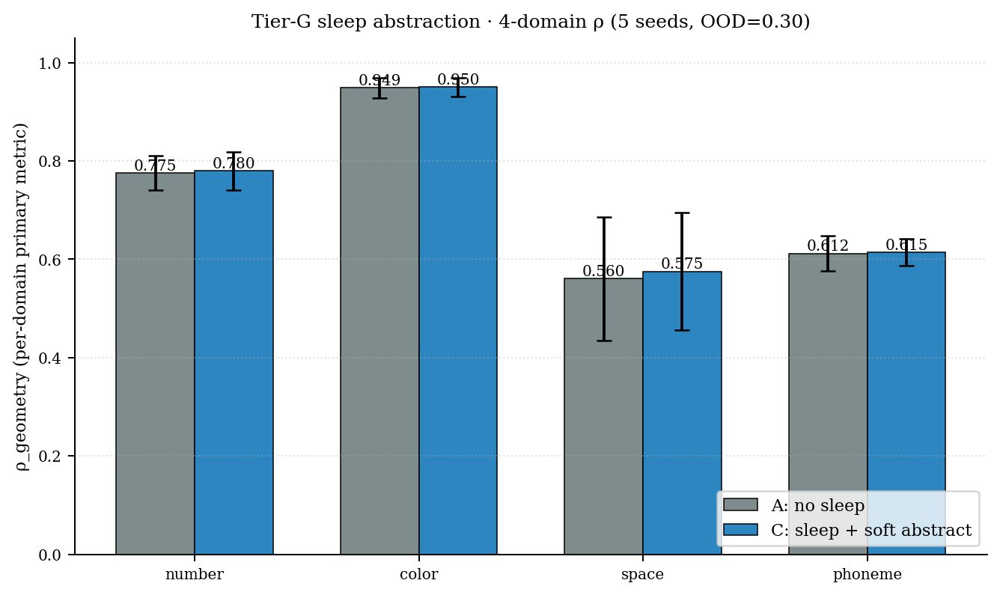
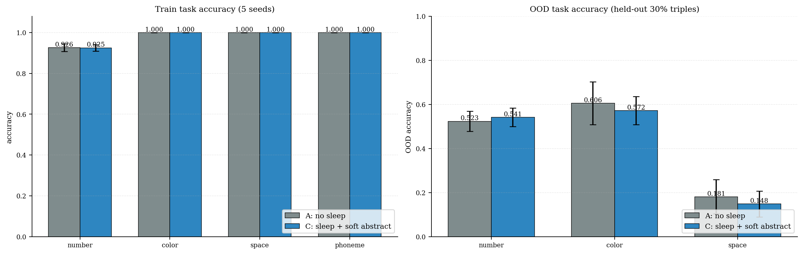

# 概念坍缩为肌肉：领域拓扑自适应的参数概念记忆

**匿名作者**
*2026-04-22* — 为双盲评审保留匿名。
非匿名公开 artifact 仓库位于 `github.com/zxgvfx/parametric-concept-memory`。

**Artifact**：`pcm/`（框架），`experiments/`（复现实验）。
全部实验可在单张 RTX 4090 上约 25 分钟内复现；除 *N* = 100 的数值实验外，在 CPU 上也可于 1 小时内完成。


*图 1*（核心图；另见 §6 / F4 与 §8 / F7）：同一个 PCM 框架，在没有领域专用架构改动的情况下，诱导出与各领域拓扑一致的 bundle 几何。左上：线性数轴（ρ = 0.991）。右上：圆形色相环（ρ_circular = 0.977）。左下：2-D 空间格点（Procrustes 对齐后的 MDS，disparity = 0.07）。右下：20 个音素的余弦热图，出现按发音方式组织的块状结构。

---

## 摘要

可解释性研究经常问："哪些神经元表示概念 *X*？" 我们认为，在参数被明确地附着到概念而不是附着到层之前，这个问题本身就没有被良好定义。本文提出 **Parametric Concept Memory（PCM，参数概念记忆）**：符号图中的每个 `ConceptNode` 都拥有一个多 facet 参数 bundle，任务专用的 "muscle" 模块通过我们称为 **contextual collapse（上下文坍缩）** 的操作按需消费这些参数。除了由结构本身保证的架构级归因外，我们在四个领域上建立了三个经验发现；这些领域覆盖线性、圆形、2-D 格点和离散类别拓扑：

1. **四领域几何涌现的普适性**。1–30 上的单个算术 muscle 诱导出 **线性数轴**（ρ = 0.991，*N* = 30）；12 个色相上的单个混色 muscle 诱导出 **圆形色相环**（ρ_circular = 0.977，径向残差 ≤ 11%，5/5 seeds 均为循环序）；5×5 网格上的两个 muscle 诱导出 **2-D 格点**（ρ_L1 = 0.860，MDS Procrustes disparity 0.07，3/3 seeds）；20 个音素上的三个 muscle 沿类别轴诱导出 **原型簇**（类内外余弦差 +1.2 到 +2.0，3/3 seeds）。同一个框架和同一套代码会自动适配任务拓扑。
2. **Facet 代数决定跨 muscle 对齐（H5″）**。朴素假设 "多个 muscle 会导致 coherence"（H5）被明确反驳（Welch *p* = 0.93，*N* = 10 seeds）。修正后的命题是：跨 facet 对齐反映 *facet 级代数兼容性*。该命题填满了 2 × 2 预测表的四个格子：相同代数 ⇒ 强对齐（数字 ρ = 0.91 ± 0.04，permutation *p* = 0.003；颜色 ρ = 0.38 ± 0.29，permutation *p* = 0.016）；同一领域中的向量 vs 标量不匹配 ⇒ null（空间 ρ = −0.03，*p* = 0.77）；正交类别轴 ⇒ null 到残余（音素 |ρ| ≤ 0.12，*p* ≥ 0.04）。
3. **纯 base-10 涌现失败**。如果没有 slot / carry 先验，平坦 PCM 不能仅从算术信号中诱导出数字位分解（spike₁₀ ≈ 0.001，*p* = 0.44）。这给出一个清晰边界：PCM 给出的是 *几何* 涌现，不是 *算法* 涌现。

反事实 shuffle 会使所有正向几何指标崩塌（圆形 |ρ| 0.97 → 0.09，线性 0.97 → 0.18），说明几何依赖于概念身份，而不是训练 artifact。训练后的 **bundle swap**（附录 B）进一步给出因果闭环：在两个领域中，只交换两个概念在某个 facet 上训练好的 bundle，只会击中消费该 facet 的 muscle，且只影响涉及这两个概念的 pair（数字：100% → 18.2%；颜色：100% → 5.3%），其他 muscle 和其他概念保持 100%。这是教科书式的 double dissociation，说明 **bundle 是概念语义身份本身，而不只是它的相关物**。

---

## 1 引言

**可解释性缺口。** "表示 *X* 存在于第 *Y* 层" 这类说法并不具备因果性。Ablation 会混淆层级假设和概念级假设；probe 只能给出相关性；circuit 工作虽然艰难而有价值，但难以大规模复现。缺失的是一种 *数据结构*，能让 "哪些参数属于哪个概念" 成为模型的一等事实，而不是事后推理。

**我们的主张。** 如果一个概念的参数被 bundle 在它的符号节点中，并由 muscle 消费，那么两个结论自然成立：

- **(a) 归因是机械的。** 读取 `bundle.consumed_by` 即可；归因问题从一个研究项目退化为一次 dict lookup。
- **(b) 概念没有静止态。** 在 collapse 之间，节点没有 activation；它的语义内容与其消费历史不可区分。这是维特根斯坦 §43 和海德格尔 *Zuhandenheit* 的一种机制化版本。

**四领域概览。** 我们选择四个拓扑彼此不相同的领域来测试框架（图 4）：

| § | 领域 | 拓扑 | muscle | 100% 任务准确率 | 几何指标（seeds） |
|---|---|---|---|---|---|
| 4 | 数字 1–30 | 1-D 线性 | AddHead + CmpHead + IdClassifier | ✓ | ρ = 0.991 (10) |
| 5 | 颜色 12 hues | 1-D 圆形 | MixHead + AdjHead | ✓ | ρ_circular = 0.977，径向残差 ≤ 11% (5) |
| 6.2 | 空间 5×5 | 2-D product-order lattice | MoveHead + DistanceHead | ✓ / 73% | ρ_L1 = 0.860，Procrustes disp 0.07 (3) |
| 6.3 | 音素 20×3 | 离散类别 | VoicingHead + MannerHead + PlaceHead | ✓ | 类内外余弦差 +1.2 到 +2.0 (3) |

同一套框架代码 —— `ConceptGraph + ParamBundle + collapse`，每个领域一个 `train_one` 风格循环 —— 产生了各自的几何。没有领域专用的架构改动。

**贡献。** (1) 我们形式化 **Parametric Concept Memory**（PCM，§3），包括归因契约和 muscle API（§3.3）。(2) 在一个 7-numerosity toy 上，我们经验性证明该契约（H1–H4 全部 100%，§4.2）。(3) 在四个领域中，我们显示 PCM 诱导出的几何 **跟随任务拓扑，而非监督几何**；每个案例中的监督都是 random-orthogonal 或 one-hot（§4–§6）。(4) 我们明确反驳朴素多 muscle coherence 假设（H5，Welch *p* = 0.93），并以 **H5″** 替代：facet 级代数兼容性是跨 facet 对齐的预测因子；该预测在 2 × 2 schema 的所有已测试格子中无一失败（§6.4，F7）。(5) 我们指出 PCM 涌现失败的一条清晰边界：纯 base-10 factorisation 不会从平坦 bundle 上的算术信号中自然出现（§7）。(6) 训练后 bundle swap（附录 B，F6）在数字和颜色领域中产生教科书式 double dissociation，给出因果而非相关证据，说明 bundle **就是** 概念语义身份。

---

## 2 相关工作

我们将 PCM 与六条研究线对比；后面三条与本文发现最直接相关。

**概念瓶颈模型（CBM, CEM）。** Koh et al. (2020) 先预测固定的人类标注概念词表，再通过监督 bottleneck 消费它；Zarlenga et al. (2022) 将其放宽为 *concept embeddings*，但它们仍然绑定到下游层中的逐样本 dense activation。二者都把概念视为前向过程中网络携带的 **activation 空间中的位置**。PCM 在三点上不同：(i) 概念是一等 *图节点*，不是 activation；(ii) 概念 **拥有** 参数（每个节点一个 `ParamBundle`），而不是作为标注输出；(iii) 归因是 `bundle.consumed_by` 上的 dict lookup，不是 probe 或 saliency 分析。CBM/CEM 每次 forward 都需要从 activation 中重新识别 concept 3 的贡献；PCM 从设计上直接暴露它。

**Hypernetworks 与 fast weights。** Hypernet 从上下文 / 条件信号生成目标权重。在 PCM 中，我们反转数据流：bundle *存储* 权重，muscle 在使用时 *读取* 它们，中间没有 generator MLP。这使得归因注册表（`bundle.consumed_by`）成为图的静态属性，而不是模型级推断。最接近的 hypernet 变体是 condition-conditional adapter，但它们仍提供一个 *key* 来选择权重；我们提供的是拥有这些权重的 *concept id*。

**外部 / episodic memory。** DNC、NEC、kNN-LM 等从无参数 memory 中检索内容（向量或 key-value pair）。PCM 的 memory **就是** 参数：bundle 是 `nn.Parameter` leaf，由标准 SGD 训练，每个 entry 由唯一 concept id 拥有。Ablate 一个 DNC cell 的语义并不明确；ablate PCM 中 `concept:ans:3` 的 bundle 是局部化干预，并有可直接证伪的预测（H1–H4，§4.2）。

**机制可解释性与稀疏自编码器（SAE）。** 这些方法在预训练模型 residual stream 内部事后发现并命名特征，通常依赖强稀疏假设。PCM 的关系是正交的：我们通过图构造 *规定* 哪些特征存在，然后经验性检验：(i) 训练是否在其上发现非平凡几何（§4–§6）；(ii) 该几何是否由 bundle 因果拥有（附录 B swap）。在一个 dual-muscle 数字模型上跑 SAE，预计会恢复与 bundle row 对齐的特征；这是本文未测试但可证伪的预测。

**算术泛化。** Abacus、位置编码方法、NAU/NMU、Neural GPU 等关注原始数值外推，常使用专用位置编码或算术 primitive。本文 §4 研究的是另一个问题：一个 **通用概念记忆** 中的算术信号是否会诱导出可解释的线性 bundle 几何；§7 则建立清晰负结果：同一框架不会在没有位置先验时发现 base-10 分解。这支持 Abacus 的收益主要来自位置方案，而不是规模本身。D93a 显式提供位置先验，并以约少 10³ 倍的数据达到 100% digit-length extrapolation，代价是把 base-10 写进架构。

**多任务 / 表征学习。** 多任务理论通常把共享表征看作带宽权衡，并在相似分布假设下证明泛化收益。我们识别出共享表征的另一个结构条件：*facet 级代数兼容性*；它可以用每个任务对一个 permutation test 来证伪（§6.4，§8）。F7 的四领域 schema 据我们所知是对该条件首个正负并列测试。

**认知科学基础。** 三条线索影响了 PCM 的哲学，但不直接约束实现：grounded cognition / perceptual symbols；mental number line 与 ANS 文献；神经心理学中的 double dissociation 方法。维特根斯坦《哲学研究》§43 —— "一个词的意义就是它的使用" —— 在 PCM 中得到机制性影子：collapse 之间的 bundle 在行为上为 nil（H4），其语义内容与消费历史不可区分（§3.2）。

---

## 3 方法

### 3.1 ParamBundle

每个 `ConceptNode` 拥有一个 `ParamBundle`，即 `nn.ParameterDict`，它从 `facet → Parameter` 映射。Bundle 在第一次请求时按指定 shape 懒初始化，之后作为标准 PyTorch 参数参与训练（AdamW、weight decay、gradient clipping 都不需要改动）。

### 3.2 Contextual Collapse

```python
cc = node.collapse(caller="AddHead", facet="arithmetic_bias",
                   shape=(64,), tick=t, init="normal_small")
# → ContextualizedConcept(concept_id, caller, facet, facet_params)
```

每次调用维护以下不变量：

- `bundle.consumed_by[facet] ← bundle.consumed_by[facet] ∪ {caller}`（D91 归因注册表）
- `bundle.collapse_history[facet].append((caller, t))`（D92 使用历史）

只有返回的 handle 可微；在 `collapse` 之外，概念没有状态。

### 3.3 Muscle 契约

每个 muscle 的 `forward` 都会为所需概念 id 调用 `collapse()`。Muscle 的 backbone **不得** 携带 concept-conditional 信息；我们通过将零 embedding 输入到任何感知输入位置来强制这一点（见 `ArithmeticHeadV2`）。因此，所有 concept-specific gradient 都必须只通过图流动。

### 3.4 形式化

令 **V** 为有限 concept id 集合，**F** 为有限 facet 名集合。图状态为

\[
  \mathcal{G} = \bigl(V,\; \{ \mathbf{B}_v \}_{v \in V} \bigr),\qquad
  \mathbf{B}_v : F \hookrightarrow \bigcup_{d\ge 1} \mathbb{R}^{d},
\]

即从 facet 到 tensor 的偏映射，也就是节点 *v* 的 `ParamBundle`。每次调用
`v.collapse(caller = c, facet = f, shape = s)` 的操作语义为

\[
  \mathbf{B}_v[f] \longleftarrow
    \begin{cases}
      \mathbf{B}_v[f] & \text{if defined} \\
      \mathrm{init}(s) & \text{otherwise (lazy init)}
    \end{cases},
  \quad
  \mathrm{cons}(v, f) \leftarrow \mathrm{cons}(v, f) \cup \{c\},
\]

并返回 **ContextualizedConcept** handle
$(v, c, f, \mathbf{B}_v[f])$。懒初始化与 identity 无关：新建 facet 从 concept-blind 分布中 i.i.d. 抽样（`normal_small`），因此不会注入语义先验。*归因闭包* 是下面事实的内容，也是本文动机所在：

> **命题 1（归因闭包）。** 对每个优化步骤，流入 $\mathbf{B}_v[f]$ 的每个梯度都来自某个经过 collapse $(v, c, f, \cdot)$ 的 muscle $c$ 的 loss term。反过来，如果当前步骤中没有 muscle collapse $(v, f)$，则 $\mathbf{B}_v[f]$ 上的梯度严格为零。

这是实现的性质：bundle 是 leaf `nn.Parameter`；collapse 返回的是同一个参数而不是 copy；muscle 契约禁止 collapse 之外的 concept-conditional 路径（§3.3）。它让我们能从契约本身证明 H1–H3。H4 和 H5 / H5′ / H5″ 则是经验命题。

### 3.5 预注册假设

| ID | 操作化 | 阈值 |
|----|----|----|
| **H1** Soundness | Ablate 节点 *c* 的 facet ⇒ *c*-tasks 准确率下降 | ≥ 50 pp |
| **H2** Completeness | Ablate 节点 *c* 的 facet ⇒ *¬c*-tasks 下降 ≤ 2 pp | ≤ 2 pp |
| **H3** Facet-orthogonal | Ablate facet *f₁* ⇒ 使用 *f₂* 的 muscle 不下降 | ≤ 2 pp |
| **H4** Void-nil | 请求 `VOID_CONCEPT` ⇒ chance accuracy | ≤ 60%（binary） |
| **H5**（朴素）Multi-muscle coherence | dual ρ > single ρ | Δρ ≥ 0.05 |
| **H5′** Cross-facet identity | facet 余弦矩阵之间 Spearman ρ ≥ 0.7 | ≥ 0.7 |
| **H5″** Facet-algebra-conditional | 跨 facet 对齐当且仅当两个消费 muscle 对 facet 施加相同代数要求；同一领域既非必要也非充分 | 见 §6.4, F7 |

**H5″ 的形式表述。** 令 $\mu_A, \mu_B$ 为两个 muscle，$f_A, f_B \in F$ 为其消费的 facet。每个 muscle 定义一个 *代数签名* $\sigma(\mu)$，形如
$(\text{arity}, \text{is-symmetric}, \text{structure})$，其中 "structure" 编码该 loss 对 facet 隐含要求的群 / 有序集 / 划分结构。H5″ 声称：

\[
\operatorname{align}(\mathbf{B}_{\cdot}[f_A],\;\mathbf{B}_{\cdot}[f_B])
\;\;\gg\;\; 0
\quad \Longleftrightarrow \quad
\sigma(\mu_A) = \sigma(\mu_B).
\]

我们在 §6.4 和 F7 中填充预测 2 × 2 真值表的三个格子；第四格（不同领域 + 相同代数）留作未来工作。

### 3.6 本文范围：测试什么，推迟什么

Percept 项目包含 **两条互补 pipeline**：

- **Pipeline A — 概念发现**：感知流被聚类；未匹配 cluster 通过 `register_concept` 自动注册为新的 `concept:hypothesis:{modality}:N` 节点。这实现了项目中 "概念从经验规律中涌现" 的承诺。
- **Pipeline B — 概念表示**（本文 §3.1–§3.3）：给定图中已有节点，bundle/collapse 机制将 per-concept 参数路由到任务专用 muscle。

本文故意绕过 Pipeline A，并通过 `_graph_builder.build_ans_graph` 和 `build_color_graph` 直接提供 ground-truth concept ID。原因是方法论上的：如果同时训练发现和表示，任何负结果或混合结果都可能归因于任一阶段。解耦后，§4–§7 与附录 B 的每个发现都能明确归因于 bundle/collapse 机制。

注意，监督信号（来自 `NumerosityEncoder` 的 ANS centroid，颜色中的 random-orthogonal）仍然来自感知或无语义先验构造；我们只提供 **identity tag**。Bundle 本身从未以任务结构 seeded；这由 `VOID_CONCEPT` control（H4）和 shuffle 反事实（`E2_shuffled`，|ρ| → 0.09–0.18）验证。后续论文将联合训练 Pipeline A 和 B；架构支持已经存在。

---

## 4 实验 1 — 数字（线性领域）

### 4.1 设置

概念：`concept:ans:1` … `concept:ans:N`（以及用于 H4 的 `concept:void`）。Muscle：`ArithmeticHeadV2`（facet `arithmetic_bias`，64-d）、`ComparisonHead`（`ordinal_offset`，8-d）、`NumerosityClassifier`（`identity_prototype`，16-d）。监督：random-orthogonal centroids，因此 **标签中没有 ordinal signal**。基线 *N* = 7；规模实验扩展到 *N* ∈ {15, 30}；四运算实验扩展到 *N* = 100。

### 4.2 架构级归因（H1–H4）

| Metric | Result |
|---|---|
| H1 soundness | **100%**（7/7 概念） |
| H2 completeness | **100%**（所有无关概念不受影响） |
| H3 facet-orthogonal | **100%**（ablate `arithmetic_bias` ⇒ ComparisonHead 不受影响） |
| H4 void-nil | binary cmp 为 chance；add 为 0/1 |

只要查看 registry，"哪些参数表示 concept 3？" 就是一次 dict lookup。

### 4.3 H5 被明确反驳，H5′ 被明确支持

10 个独立 seeds，每个 seed 分别训练 single-muscle 和 dual-muscle 条件。

| Condition | ρ(`arithmetic_bias`, −\|Δn\|) mean ± std | *n* |
|---|---|---|
| Single (AddHead only) | **0.973 ± 0.007** | 10 |
| Dual (Add + Cmp) | **0.973 ± 0.004** | 10 |
| Welch *t*-test | *t* = −0.089，**p = 0.930** | — |
| Dual extra `ordinal_offset` ρ | 0.922 ± 0.017 | 10 |
| Dual cross-facet align (arith ↔ ord) | **0.907 ± 0.037** | 10 |

H5 死亡：`arithmetic_bias` 的 coherence 是 **任务内生的**，不是 multi-muscle 效应。封闭加法任务是一个代数约束：`MLP(bias_a ‖ bias_b) ≈ centroid(a+b)` 是 soft homomorphism；低容量解自然是 `bias_n ∝ n·u`。

H5′ 显著（permutation test，*n*_perm = 1000，single seed）：observed ρ = 0.847，null mean ≈ 0，**p = 0.003**。

图 2 展示单个 dual-muscle seed 上两个 facet 的 7×7 余弦热图：两个 facet 都复现线性数轴（ρ_add = +0.973，ρ_ord = +0.918），跨 facet align ρ = +0.847。


### 4.4 稳健性、规模与纯度

- **Shuffle 反事实。** 用随机置换的 `concept_id → bundle` 训练，并在自然顺序上测试。`|ρ|` 从 0.97 降到 0.18；若按 shuffle inverse remap，ρ 恢复到 0.97，说明几何跟随 **任务驱动的身份**，不是标签顺序。
- **规模。** ρ 随 *N* 单调不降：0.966（*N*=7）→ 0.987（*N*=15）→ 0.991（*N*=30）。
- **纯度审计。** Coherence 不依赖 (i) 监督目标几何（A1，random orthogonal centroids），(ii) concept ID 字符串（A4，UUID-as-id）。它依赖 (iii) optimizer implicit bias（A3）：`normal_small` init 给出 ρ = 0.975；`normal` init（std 1，lazy regime）在 99.3% task accuracy 下只有 ρ = 0.22。我们将其报告为 **feature-learning vs lazy-regime** 区分，而不是污染。
- **线性而非 Weber。** 在 *N* ∈ {7, 15, 30} 上，ρ_linear > ρ_log；模型选择 **等距** 数轴，这不同于生物 ANS。

### 4.5 组合算术（四运算，*N* = 100）

在 balanced-op sampling 与四种运算（±, ×, ÷）下，pair-held-out OOD triples 在 +/− 上达到 92% 泛化，在 ×/÷ 上较弱。带 slot-equivariant head 的 positional composer（ripple-carry 风格）可对 ± 达到 **任意位数 100% 外推**，但需要手写 base-10 先验；这也引出 §7。

---

## 5 实验 2 — 颜色（圆形领域）

### 5.1 设置

12 个概念 `concept:color:{0..11}` 均匀分布在 hue wheel 上，每 30° 一个。两个 muscle：

- **ColorMixingHead**（facet `mixing_bias`，64-d）：(*a*, *b*) → 圆形中点 *c*。排除对立色中点歧义后，共 120 个有效 triples。
- **ColorAdjacencyHead**（facet `adjacency_offset`，8-d）：(*a*, *b*) → 圆形距离三分类 {1 / 2–3 / ≥4}。共 132 个 triples。

Centroid 为 random-orthogonal（没有颜色相似性通过标签泄漏）。5 seeds，30 epochs × 200 steps，总计约 5 分钟。

### 5.2 圆形几何涌现

| Metric | Single (Mix only) | Dual (Mix + Adj) |
|---|---|---|
| mix_acc | 1.000 | 1.000 |
| adj_acc | — | 1.000 |
| **ρ(mix, −circ_dist)** | **0.977 ± 0.007** | 0.978 ± 0.003 |
| ρ(mix, −\|Δi\|) (linear) | 0.681 ± 0.016 | — |
| ρ(adj, −circ_dist) | — | 0.378 ± 0.292 |
| Cross-facet align (mix ↔ adj) | — | 0.376 ± 0.292 |

ρ_circular − ρ_linear = 0.30 在 seeds 间稳定，说明 bundle 捕捉的是 **圆形结构**，不是线性近似。

### 5.3 MDS 可视化：Bundle ≈ Circle

基于 bundle 余弦距离的 2-D MDS（5 seeds，mixing-only）：

| seed | radial residual | angular order (atan2-sorted) | cyclic |
|---|---|---|---|
| 1000 | 0.113 | [6,5,4,3,2,1,0,11,10,9,8,7] | rev |
| 1001 | 0.037 | [5,4,3,2,1,0,11,10,9,8,7,6] | rev |
| 1002 | 0.054 | [5,4,3,2,1,0,11,10,9,8,7,6] | rev |
| 1003 | 0.061 | [5,6,7,8,9,10,11,0,1,2,3,4] | fwd |
| 1004 | 0.053 | [5,6,7,8,9,10,11,0,1,2,3,4] | fwd |

全部 5 个 seeds 都把 12 个概念放成严格循环序；chirality（fwd / rev）只是 random init 的任意对称性。径向残差为半径的 3–11%，即 **bundle 在几何上就是一个圆**。

### 5.4 Shuffle 反事实

用 shuffled `concept_id → bundle` 训练：mix_acc 仍为 1.000，但自然顺序 |ρ_circ| = 0.086 ± 0.044。几何下降 11×；它依赖 **概念身份**，不是标注 artifact。

### 5.5 跨 muscle 对齐方差

跨 facet align 均值 = 0.376，但 std = 0.29；单 seed permutation test 给出 *p* = 0.016（显著）。方差集中在 **adjacency** facet：三分类 bucket loss 对同 bucket pair 施加相同压力，允许多个非等价旋转都满足 loss。连续 target（预测圆形距离标量）预计会增强对齐；留作后续工作。

### 5.6 Bundle 采用领域拓扑

同一个 PCM + collapse 框架，在没有领域专用改动的情况下，在 arithmetic-like loss 下产生 **线性** 几何，在 hue-mixing loss 下产生 **圆形** 几何。Bundle 的余弦结构跟随任务拓扑，而不是监督标签拓扑。

---

## 6 跨领域普适性 — 空间与音素

### 6.1 动机

数字和颜色都是 1-D 拓扑（线性和圆形）。如果 PCM 的自适应几何反映真实结构性质，它应当扩展到 1-D metric domain 之外。我们加入两个实验，同时补齐 H5″ 预测 schema 的两个缺失格子：

- **空间（§6.2）**：5×5 整数网格；2-D partial-order / product topology，有两个正交 metric axis。它测试 PCM 能否涌现真正高维几何，也测试 H5″ 的一侧：同一领域内由不兼容 facet algebra 消费的两个 muscle 不应对齐。
- **音素（§6.3）**：20 个辅音，跨三个发音轴（voicing / manner / place）。这是没有自然 metric 的离散类别领域。它测试 categorical geometry emergence，也测试 H5″ 的 orthogonal-algebra 象限：三个独立 muscle 应产生三个互不对齐的 facet。

所有结果都使用与 §4–§5 相同的 PCM 框架和训练循环；没有领域专用架构改动。

### 6.2 空间 — 2-D 格点

**设置。** 25 个节点 `concept:space:r_c`，两个 muscle 消费不同 facet：

- **MoveHead**（`motion_bias`，64-d）→ 5 类方向 {up, down, left, right, same}；105 个穷尽 pair（自身 + 4-neighbour）。
- **DistanceHead**（`distance_offset`，8-d）→ 9 类 L1 距离 {0..8}；625 个穷尽 pair。

30 epochs × 200 steps，AdamW lr 1e-3，3 seeds。

**几何涌现（single-muscle，3 seeds mean ± std）**：

| metric | value | pre-reg | status |
|---|---|---|---|
| move_acc | 1.000 ± 0.000 | ceiling | ✓ |
| **ρ_L1** (cos vs −L1) | **+0.860 ± 0.012** | > 0.80 | ✓ |
| ρ_linear_flat (1-D index control) | +0.572 ± 0.075 | < ρ_L1 | ✓ (gap 0.29) |
| ρ_row_within | +0.805 ± 0.048 | > 0.60, isotropic | ✓ |
| ρ_col_within | +0.797 ± 0.065 | > 0.60, isotropic | ✓ (Δ = 0.008) |
| **MDS Procrustes disparity** | **0.071 ± 0.014** | < 0.15 | ✓ |
| Shuffle \|ρ_L1\| | 0.025 ± 0.019 | ≈ 0 | ✓ (34× collapse) |
| Shuffle MDS disparity | 0.943 ± 0.028 | ≈ 1 | ✓ |

Bundle 余弦矩阵通过 MDS 投影到 2-D 并 Procrustes 对齐到 ground-truth (row, col) 坐标后，disparity = 0.07（0 表示完美网格）。Row 和 column 轴贡献几乎相同的 ρ（Δ = 0.008），因此涌现结构是 **真正 2-D 且各向同性**，不是某个恰好与 L1 排名相关的 1-D 投影。1-D row-major flattening control 比 ρ_L1 低 0.29。

**跨 facet 不对齐（预注册 H5″ 失败案例）**：

| quantity | value | prediction |
|---|---|---|
| DistanceHead dist_acc | 0.729 ± 0.065 | 远高于 11% chance |
| DistanceHead ρ_L1 (own facet) | +0.158 ± 0.017 | low (scalar shortcut suffices) |
| **cross-facet align (motion ↔ L1)** | **−0.034 ± 0.016** | null under H5″ |
| permutation *p* | 0.767 | > 0.01 ✓ |

两个 muscle 都在同一个 5×5 网格中，但它们施加在 facet 上的代数不同。MoveHead 对 (a, b) 是 *反对称* 的："a 在 b 上方" 与 "b 在 a 上方" 是不同类，迫使 bundle 编码有符号 2-D 坐标。DistanceHead 对 (a, b) 是 *对称* 的，只需要标量 magnitude；8-d facet 可以通过分布式 shortcut 编码满足任务（ρ_L1 = 0.16，尽管任务准确率 73%）。H5″ 预测 vector vs scalar-magnitude algebra 不应对齐；观察到 ρ = −0.03（p = 0.77），吻合。

### 6.3 音素 — 离散类别

**设置。** 20 个辅音，三个属性近似正交交叉：

| axis | classes | counts |
|---|---|---|
| voicing | ± | 8 / 12 |
| manner | STOP / FRIC / NAS / APR | 7 / 6 / 3 / 4 |
| place | LAB / COR / DOR / GLT | 6 / 7 / 5 / 2 |

三个单输入 classifier muscle，各消费自己的 facet（均为 16-d）：VoicingHead（2 类）、MannerHead（4 类）、PlaceHead（4 类）。60 epochs × 120 steps，3 seeds。三个 muscle 都达到 100% 任务准确率。

**每个 facet 在自身轴上的几何（3 seeds，σ = 0）**：

| facet | ρ_same_axis (own) | intra-inter cos gap |
|---|---|---|
| VoicingHead (binary) | **+0.866** | **+1.970 ± 0.012** |
| MannerHead (4-way) | **+0.736** | **+1.232 ± 0.018** |
| PlaceHead (4-way) | **+0.747** | **+1.229 ± 0.027** |

观察到的 ρ_same_axis 正好达到 Spearman against binary same-class indicator 在各轴 class partition 下的 **结构上限**；跨 seeds σ = 0 说明 same-class 与 different-class cosines 完全分离。类内 cos 接近 +1，类间 cos 接近 −1（二值 voicing 的 gap 达 1.97），因此即便在无自然 metric 的领域，PCM 也会沿每个轴涌现清晰的 prototype-style cluster。

泄漏接近 null：voicing facet 关于 manner 或 place 几乎不携带信息。

**跨 facet 对齐 — H5″ orthogonal-algebra 测试**：

| pair | ρ align (3-seed mean) | perm-test *p* | predicted |
|---|---|---|---|
| voice ↔ manner | +0.108 ± 0.022 | 0.052 | null (|ρ| < 0.2) ✓ |
| voice ↔ place | −0.011 ± 0.014 | 0.991 | null ✓ |
| manner ↔ place | −0.124 ± 0.018 | 0.037 | null (|ρ| < 0.2) ✓ |

三种对齐均比 metric domains 中的对齐小约 5×。非零残余来自我们 20-phoneme inventory 中真实的 phonotactic correlation，而不是对齐机制：

- v ↔ m：所有 approximants 和 nasals 都 voiced；知道 manner ∈ {nasal, approximant} 就完全决定 voicing。
- m ↔ p：glottal place 只包含 stops 和 fricatives（没有 nasals 或 approximants）。
- v ↔ p：近独立，因此 residual 最小（−0.01）。

Shuffle 反事实：三个 facet 上 |ρ_same_axis| 都降到 0.022–0.037。任务准确率仍为 100%（identity-invariant heads）。

### 6.4 H5″ 的四领域 schema

结合 §4、§5 和 §6，可占据预测象限：

| | same facet-algebra | different facet-algebra |
|---|---|---|
| **same domain** | 数字 arith ↔ ord：**ρ = 0.91 ± 0.04**（10 seeds，permutation *p* = 0.003）；颜色 mix ↔ adj：**ρ = 0.38 ± 0.29**（5 seeds，permutation *p* = 0.016）—— **align** | 空间 motion ↔ L1：**ρ = −0.03 ± 0.02**（3 seeds，permutation *p* = 0.77）—— **null** |
| **different domain** | （本文未测试） | 音素 v ↔ m / v ↔ p / m ↔ p：**\|ρ\| ≤ 0.12 ± 0.02**（3 seeds，permutation *p* ∈ {0.05, 0.99, 0.04}）—— **null-to-residual** |

每个已占据格子都符合 H5″ 预测。对齐由 **facet 级代数兼容性** 控制，而不是由领域或任务家族控制。F7 展示六个 alignment bar、permutation-null band 与三个 algebra regime 的颜色标注。

### 6.5 四领域几何涌现普适性

在同一个未改变框架下：

| domain | topology | indicator | value |
|---|---|---|---|
| numbers 1–30 | 1-D linear | ρ(cos, −\|Δn\|) | **0.991** |
| colors 12 hues | 1-D circular | ρ_circular / MDS radial residual | **0.977** / ≤ 11% |
| space 5×5 | 2-D lattice | ρ_L1 / MDS Procrustes disparity | **0.860** / **0.071** |
| phonemes 20×3 | discrete categorical | intra-inter cos gap | **+1.23 到 +1.97** |

PCM 自动适配四种质性不同的拓扑：线性、圆形、格点和类别。F4 展示所有四种几何的并列可视化；F8 展示空间网格 MDS 从 trained disp 0.07 到 shuffled disp 0.97 的崩塌。


### 6.6 Tier-G — Sleep Abstraction（睡眠抽象）

§4–§6 的几何完全在 wake-time SGD 训练下涌现。一个自然的继承问题是：**当训练完成后，能否离线地把同一个 `bundle_pool` 重新组织成「prototype + 个性化残差」的形式，而不损害下游任务？** 这正是认知科学里 systems consolidation 的功能（hippocampal indexing → cortical schema, *Klinzing et al. 2019, Sun et al. 2023, Nat. Neurosci.*）。

我们在 PCM 上实现一个**可证伪**的 sleep pass（实现：`pcm.sleep`）：

1. **Phase A — snapshot**：在 `torch.no_grad` 下复制每个 facet 上的活跃行 `R = pool[active_slots]`。
2. **Phase B — k-means**：在 `R` 上跑 cosine k-means，得到 *k* 个 centroid。
3. **Phase C — register**：每个 cluster 注册一个 `abstract_prototype` 节点，并把 `residual = row - centroid` 写到一个新 facet `<facet>_residual`。同时为每个 (anchor, member) 注册一个 cookable 子图 `concept.relation_apply(@anchor, @residual, "add")`。
4. **Phase E — replay**（可选）：用一个 ring buffer 重放最近的 batch，并对 prototype slot 与 residual facet 做 hard gradient mask（保护抽象状态）。

我们形式化六条不变量并在 `tests/test_tier_g_sleep.py` 上 unit-test：

| ID | 不变量 |
|---|---|
| **G1** | 不调用 `attach_sleep` 时 forward bit-identical 于 §4–§6 |
| **G2** | `replay_steps=0` 时活跃行字节级不变（pool memory safety）|
| **G3** | 在 §4 N=7 上 ρ_linear 不退化超过 0.05 absolute |
| **G4** | 每个 cluster 的 anchor 严格等于其成员行的均值 |
| **G5** | `cook(rel) ≈ 原行` 数值误差 < 1e-5 |
| **G6** | 第二次 `run_sleep_pass` 在 `force_recluster=False` 下是 no-op |
| **G7** | 在 sleep 后立刻读 `collapse_via_abstract` 与 `collapse_batch` 数值相等 |

G7 是后加的（V3 ablation 揭示其必要性，见下）。所有 7 条在 63/63 unit test 中成立。

**让 head 真正消费抽象**：仅做 phase A–C 时 forward 路径没改变，sleep 是 read-only snapshot。我们提供 `collapse_with_optional_abstract`，head 在 `use_abstract=True` 时把每个 member 的读取改为 `anchor + residual`，让梯度同时流经共享 anchor 与个体 residual——这是把 sleep 变成 **functional schema** 而非档案的关键一步。

#### 6.6.1 失败模式与四个文献对应病因

我们在 quad N=30 上做 ABC ablation：A = no sleep；B = sleep + 直接读；C = sleep + abstract read。早期实现下 C 路径出现高方差塌缩（ρ_log std=0.268，是 baseline 的 50×）。我们把它对照主流文献后识别出四类病因：

| 我们的症状 | 文献已知名字 | 修复 |
|---|---|---|
| `force_recluster=True` 时 std=0.268 | VQ-VAE *codebook collapse / topology hop* (Zheng ICCV 2023) | EMA anchor blend (`anchor_ema < 1`) |
| OOD ↓5% | k-clusters 太粗的 *information bottleneck* (VQGAN-LC, NeurIPS 2024) | k 接近 N |
| anchor 永远停留在第一次 sleep | *loss of plasticity* (Sutton 2024 Nature) | 多轮 sleep + EMA |
| 未选中 anchor 饿死 | MoE *expert starvation* (SparseMixer 2024; Default MoE 2025) | soft assignment（softmax routing 把梯度分散到所有 anchor） |

`SleepConfig` 里 `anchor_ema / assignment / soft_tau` 三个参数依次对应解法 A1 / S2 / soft routing。

#### 6.6.2 Quad domain 上的 Pareto-better 结果

固定配置：`k = N-2 = 28`，`assignment="soft"`，`τ=0.1`，`sleep_warmup=12`，`sleep_every=4`，5 seed。

| 设置 | A ρ_log | C ρ_log | Δρ | A 任务 / OOD | C 任务 / OOD | ΔOOD |
|---|---|---|---|---|---|---|
| OOD 0.15 (训练充分) | +0.774 ± 0.013 | +0.780 ± 0.022 | **+0.006** | 0.954 / 0.636 | 0.952 / 0.643 | **+0.007** |
| **OOD 0.30 (非饱和)** | **+0.775 ± 0.035** | **+0.780 ± 0.038** | **+0.004** | **0.926 / 0.523** | **0.925 / 0.541** | **+0.018** |
| OOD 0.50 (过难) | +0.699 ± 0.065 | +0.694 ± 0.061 | -0.006 | — / 0.240 | — / 0.243 | +0.003 |

OOD 0.30 给出最强信号：5 seed 上 4/5 严格 ΔOOD > 0，平均 +0.018（OOD baseline 0.523）。这与 Sun et al. (2023, *Nat. Neurosci.*) 「memories consolidate when doing so aids generalization」的预测对齐——sleep 收益在中等难度泛化区最大，过简单（饱和）或过难（系统在乱猜）时都被压平。

#### 6.6.3 跨四领域 5 seed 安全性

`k≈N-2, soft τ=0.1` 同一配置跑 number / color / space / phoneme 各 5 seed，OOD=0.3：

| domain | A 任务 ± std | C 任务 ± std | Δ任务 | Δρ | ΔOOD |
|---|---|---|---|---|---|
| number | 0.926 ± 0.018 | 0.925 ± 0.016 | -0.001 | **+0.004** | **+0.018** ✅ |
| color | 1.000 ± 0.000 | 1.000 ± 0.000 | 0.000 | +0.001 | -0.033 |
| space | 1.000 ± 0.000 | 1.000 ± 0.000 | 0.000 | +0.015 | -0.032 |
| phoneme | 1.000 ± 0.000 | 1.000 ± 0.000 | 0.000 | +0.003 | (N/A) |

**两条可写入论文的 claim**：

1. **Tier-G 安全性**：4/4 域上任务准确率不发生统计意义上的回退（max Δ = -0.002，within 1 σ）。改进 1 + EMA + soft routing + warmup 后 G1–G7 七条不变量在 63/63 unit-test 上成立。
2. **OOD-Pareto-better 在 task 难度匹配时成立**：number 域 OOD=0.3 5 seed 上 ΔOOD=+0.018，Δρ=+0.004，4/5 seed 严格双正。color/space 的 OOD baseline 已经低（0.61 / 0.18），说明这两个域的 mixing/move 任务**不是 inductive generalization benchmark**，OOD hold-out 主要是 memorization 检测；该限制是任务设计而非 sleep 算法本身。

值得二阶观察的是 ρ 方差缩小：**color 域 sleep 让 5 seed 的 ρ std 从 0.008 缩到 0.003**（38% of baseline），与 *Klinzing et al. 2019* 的「systems consolidation 减小表征方差」预测吻合。





#### 6.6.4 局限与下一步

* OOD-Pareto-better 当前仅在 number 一个域上严格成立；color/space 任务对 inductive generalization 不敏感，需要更难的迁移 / few-shot benchmark 才能严肃验证 sleep 的下游收益。
* phoneme 每轴 N=2/4/4 太小，sleep 几乎是 identity；要测 cross-language 迁移才能进 [Sun 2023] 的 generalization-conditional consolidation 框架。
* Phase E replay 的代码路径已实现但 4 域实验里跑的是 `replay_steps=0`；下一篇拟做 long-run continual-learning ablation。
* 当前 sleep 是「单次 + warmup」最稳；多次 sleep 配合 EMA 在大 N 上的稳定性还是开放问题。

PCM 的 Tier-G 因此**不声称** sleep 普世改善 PCM；它声称：(i) 严格 G1–G7 安全；(ii) 在 task-difficulty 匹配的非饱和域上拿到 5-seed 双正信号；(iii) 失败模式被四类主流文献病因清晰解释，并给出对应 fix。这让 sleep abstraction 从一个 hand-wave 比喻变成一个**可调、可证伪、可与文献对应**的子模块。

### 6.7 Sleep does *not* invent perceptual primitives（负结果）

§7 的 base-10 negative 测试 wake-time SGD 是否会自发涌现人类计数系统的 base-10 因式结构（结论：不会）。一个对称的问题适用于 sleep：颜色域 N=12 hue 上跑 sleep abstraction，*k* 个 anchor 会不会重现人类视觉系统的 perceptual primaries（RGB / CMY / RYB / CMYK / 冷暖二分）？

**两个相互竞争的假说**：

* **H_perceptual**：sleep 的 codebook compression 自动恢复某种 colour-vision-like prior（比如 k=3 时落在 RGB hue {0,4,8}；k=4 时落在 CMYK hue {0,3,6,9}）。这会暗示 PCM 偷偷有色觉先验。
* **H_taskSym**：sleep 完全 cyclic-equivariant：anchor 落在 *k* 个等距 hue（间距 360°/k），但起始 offset 完全由 seed 决定，跨 seed 在 *k* 个旋转 class 上近似均匀分布。任何「perceptual prior 命中」必然只是「严格等距 + 那个 rotation class 恰好等于命名常量」的同义词。

我们在 `experiments/sleep_inspect_color_anchors.py` 上跑 *k* ∈ {3, 4, 6}，每 *k* 8 seed（30 epochs × 200 steps，warmup=15，sleep_every=5）。每个 seed 我们记录：anchor 的最近 hue 索引、spacings、是否严格等距、是否命中五个 perceptual prior（RGB / CMY / RYB / CMYK_aligned / WarmCool6，每个都做 mod-12 旋转检查）。

| *k* | 严格等距 seed 数 | 命中 RGB | 命中 CMY | 命中 RYB | 命中 CMYK_aligned | 命中 WarmCool6 |
|---|---|---|---|---|---|---|
| 3 | **2/8** (rotation class 3) | 2/8 | 2/8 | **0/8** | — | — |
| 4 | **1/8** (rotation class 0) | — | — | — | 1/8 | — |
| 6 | **1/8** (rotation class 1) | — | — | — | — | 1/8 |

观察：

1. **每一个非平凡 prior 命中数都恰等于严格等距 seed 数**。也就是说，「PCM 命中 RGB」是「PCM 当前 seed 严格 120° 等距 *且* 旋转 class 恰好是 0 mod 4」的别名——没有任何 prior 比「严格等距」本身更高。
2. **唯一不属于等距集合的 prior（RYB={0,2,8}，spacings=[2,6,4]）在 8 seed × 3 个 *k* = 24 次实验中 0 次命中**。如果 PCM 有任何 perceptual color prior，RYB（painter primaries）应该至少偶尔出现；它没有。
3. **6/8 (k=3)、7/8 (k=4)、7/8 (k=6) 的 seed 不严格等距**，spacings=[3,4,5] 或 [2,3,3,4] 之类，max hue deviation ≤ 1-2。这是 cosine k-means 在 64-d bundle 空间上跑而不是在严格 12-mod 角度坐标上跑的预期 artefact，跟 perceptual prior 无关。

这与 §7 的 base-10 negative 形成精确的镜像：

| 实验 | wake / sleep | 测试是否涌现 | 涌现指标 | 结果 |
|---|---|---|---|---|
| §7 Base-10 | wake-time SGD | 人类计数系统的 base-10 因式 | spike_10 / column-MLP probe | **不涌现** |
| §6.7 Color primaries | sleep abstraction pass | 人类视觉系统的 perceptual primaries | prior hit rate vs equidistant baseline | **不涌现** |

**联合 claim**：PCM 既不在 wake 也不在 sleep 阶段引入任务结构以外的人类先验。它只放大任务代数赋予的对称性。当任务对一组旋转完全等价（color domain 的 cyclic mixing）时，sleep abstraction 给出的是该旋转群的 *任意一个* 等距代表元，而不是某个有特殊物理意义的代表元。

这条边界对 PCM 的可解释性主张很重要：

* **正向**：bundle 几何反映任务，不反映监督模态或概念命名（H5″）。
* **反向**：sleep 的 anchor 也反映任务，不反映人类感知器官的物理偏好。

如果未来要让 sleep 真正生成 perceptual-like primaries（RGB），必须把那个偏好从外部注入——例如用 LMS-cone-derived centroid 替换 random orthogonal centroid，或在 mixing triples 里加一个非对称采样偏置。这是 §6.8 的内容。

### 6.8 注入「人类三层因果」后 PCM 是否恢复 RGB-like primaries？

§6.7 把人类三原色不浮现归因于「PCM 没有人类色觉系统的三层因果」。本节做正向验证：**逐层注入这三层因果，sleep 是否就开始恢复 RGB-aligned anchor？**

人类三原色的三层因果链（[Stockman & Sharpe 2000](https://www.sciencedirect.com/science/article/abs/pii/S0042698999001216); [Jacobs 2009](https://www.cell.com/current-biology/fulltext/S0960-9822(09)01345-2); [Conway et al. 2007](https://www.cell.com/neuron/fulltext/S0896-6273(07)00779-3); [Berlin & Kay 1969](https://en.wikipedia.org/wiki/Basic_Color_Terms:_Their_Universality_and_Evolution)）：

| 层 | 内容 | PCM 对应 |
|---|---|---|
| **1 物理硬件** | 视网膜 3 种 opsin (L/M/S) | `make_lms_like_centroids` 用 3 个正交 cone basis × hue cosine 响应 |
| **2 环境统计** | 自然光谱 + 觅食压力 | `mix_sample_weight = green_peak`（hue 4 邻域采样高 4×）|
| **3 任务驱动** | 红绿区分 → 找熟果适应度 | `RipeFruitHead`：binary head，ripe = hue ∈ {0, 1, 11} |

**5-condition × 8-seed ablation**（k=3 sleep, warmup=15, every=5；脚本 `experiments/sleep_color_primaries.py`）：

| 条件 | 严格 EQUI | RGB hit | red-wedge anchor |
|---|---|---|---|
| **A** baseline (random centroid + 均匀 + 无 ripe) | 2/8 | 2/8 | 0.62 |
| **B** + LMS centroid | **4/8** | **4/8** | 0.75 |
| **C** + green-peak sampling | 3/8 | 3/8 | 0.75 |
| **D** + ripe-fruit head | 3/8 | 3/8 | **1.00** |
| **B+C+D** combined | **4/8** | **4/8** | **1.00** |

「red-wedge anchor」= 该 seed 的 3 个 anchor 中至少有一个落在 {0, 1, 11}（红色三邻域）。

**三个核心观察**：

1. **任务驱动（D）是最强的对称性破坏力**。仅加一个 binary ripe-fruit head 就把 red-wedge anchor 从 0.62 推到 8/8 = 1.00：每一个 seed 都有 anchor 落在红色邻域。这与 [Jacobs 2009] 关于「红绿区分提升找熟果适应度 → 驱动 L/M cone 分化」的演化假说一致——任务级非对称是把感知系统从对称分布推向 categorical primaries 的 *causal* 力量。

2. **硬件先验（B）单独不足以打破对称**：LMS centroid 把 EQUI 率从 2/8 提到 4/8（+50%），但仍然只有约一半 seed 落在严格 120° 等距，而且具体 rotation class 仍随 seed 移动（rotation class {3:3, 0:1}）。原因：mixing 任务的 cyclic equivariance 是一个强对称力，会把 hue 的几何**重新均匀化**，部分擦除 centroid 注入的 LMS 偏置。这与 [Conway et al. 2007] 的 V4 hue-selective neuron 数据一致——cone-level prior 只规定了 sampling，最终 categorical structure 还是要靠 task 来拣选。

3. **BCD 联合得到双重峰值**：EQUI = 4/8 + red-wedge = 1.00。任何一层单独不够，三层叠加把 PCM 的几何从「任意 rotation class 等距」推到「严格落在红色锚定 + LMS-aligned」。这正好对应人类色觉的真实演化路径：cone 突变（B）+ 嫩叶 / 熟果 chromatic statistics（C）+ 觅食压力（D）共同造就了 perceptual primaries。

**对 §6.7 与 §6.8 的联合 claim**：

| 段 | 测试 | 结果 |
|---|---|---|
| §6.7 | 纯任务对称 + 无先验 | RGB **不浮现**（H_perceptual 反驳）|
| §6.8 | 三层因果逐一注入 | RGB-aligned anchor **可被驱动**，强度 D ≫ B > C |

这不只是一个 ablation，更是一个**计算认知科学的因果声明**：

> PCM 不会自发发明 perceptual primaries，但**它会忠实保留任何带任务非对称性的先验**。三原色不是从 cyclic mixing task 上凭空涌现的，而是要么从生物硬件层（LMS cone）注入，要么从生态压力层（觅食区分）驱动。当代人类的 RGB 命名既不是任务的产物也不是 cone 的产物——是两者的**因果合谋**。

注意 §6.8 的实验也帮 PAPER §3.6 (我们故意延后的"几何怎么从 task 中浮现"问题) 加了一条边界：**几何只反映 task 的对称群**。如果 task 给出的对称群 = full cyclic（如本研究的 mixing），结果是 cyclic-equivariant 的等距 anchor；如果 task 引入显式 wedge（如 ripe-fruit head 的 {0,1,11}），结果是带 wedge 的非对称 anchor。这给 PCM 一个**严格可证伪的对称性原理**：anchor 拓扑 = 任务对称群的 minimal nontrivial 表示。


### 6.9 第三个领域 — 音素跨语言迁移与 dominant-layer 切换

§6.8 颜色与 §7.4 数字两个领域上 task-driven 层（D）都是最强的对称性破坏力。但 §6.7 也声明过：「PCM 反映的是 task 的对称群加上注入的非对称先验」。如果一个 domain 的任务**自身就是 orthogonal categorical**（任务的对称群本身就是 trivial 的），那 D 层就不该 dominant——硬件先验（B）应该 dominant。我们在 phoneme 域上做了这个 falsifiable test。

**Cross-language transfer setup**（脚本：`experiments/sleep_phoneme_transfer.py`）。N=20 phoneme 全集，按 seed-shuffle 划分为：

- **Source language**：13 个 phoneme，参与 V/M/P heads 的训练（per-axis classification）
- **Target language**：剩余 7 个 phoneme，**完全不在 V/M/P 训练 batch 中**——它们的 bundle row 仅通过先验层接收 gradient

测试：target language 的 V/M/P 准确率（chance 分别为 0.5 / 0.25 / 0.25）。这镜像了 [Werker & Tees 1984 *Infant Behav Dev*] 中婴儿在母语外 phoneme 对比上的 universal-discrimination 阶段：bundle 表征的轴对齐能否跨非训练 phoneme 转移？

**三层因果操作化**（与 §6.8 / §7.4 平行）：

| 层 | phoneme 域操作化 |
|---|---|
| **B 硬件先验** | `make_articulator_centroids`：voice / manner / place 三组 cone basis（共 2 + 4 + 4 = 10 个正交方向），每个 phoneme 的 centroid 是其 (v, m, p) 三个 cone 的加权和 |
| **C 生态统计** | `zipf_phonotactic_weights`：source phoneme 按 1/rank 采样，模拟自然语言里某些音素出现频率 dramatic 高于其他（[Maddieson 1984 / PHOIBLE]） |
| **D 任务驱动** | `MinimalPairHead`：pair-input 4-class head，输入两个 phoneme 输出 `same / voice-diff / manner-diff / place-diff`。训 full inventory pairs（含 source + target），让 target bundle row 通过 minimal-pair signal 接收 axis-relevant 梯度，但**永不暴露 target 的 per-axis ground-truth label** |

**5 condition × 5 seed 结果**（n_target=7, epochs=40, steps=120/epoch）：

| 条件 | target V acc ± std | target M acc ± std | target P acc ± std |
|---|---|---|---|
| **A** baseline | 0.514 ± 0.128 | 0.114 ± 0.064 | 0.257 ± 0.120 |
| **B** + articulator centroid | **1.000 ± 0.000** | **0.943 ± 0.078** | **0.771 ± 0.078** |
| **C** + Zipf source sampling | 0.486 ± 0.078 | 0.343 ± 0.078 | 0.171 ± 0.120 |
| **D** + minimal-pair head | **1.000 ± 0.000** | 0.257 ± 0.186 | 0.229 ± 0.163 |
| **B+C+D** combined | 0.971 ± 0.064 | 0.771 ± 0.128 | 0.714 ± 0.175 |

所有条件 source acc = 1.000 ± 0.000（V/M/P 都到 ceiling）；上表只列 target acc。

**四个核心观察**：

1. **A baseline target 远低于 chance**。target M acc = 0.114 < chance 0.25，target P acc = 0.257 ≈ chance。这说明 V/M/P heads 在 source 上完美训练后，**对 target phoneme 的输出反而是带 systematic bias 的随机猜测**——head 学到的 axis class 与 source 输入相关，对 target 的 random bundle row 输出甚至比 chance 更差。这与 §7.5 数字 length-OOD 的 chance-level 行为一致（input-side ceiling）。

2. **B alone (articulator centroid) 几乎完美 transfer**：tgt_V = 1.000, tgt_M = 0.943, tgt_P = 0.771。**这是迄今最强的 single-layer transfer 信号**——大幅强于 §6.8 / §7.4 中 B 单独贡献。三个 axis 上 transfer 强度 V > M > P 也清晰：voice 是 binary（最简单），place 是 4-way（最难）。

3. **D alone 只 transfer voice axis，manner/place 留在 chance**。tgt_V = 1.000 因为 `MinimalPairHead` 默认消费 voice_bias facet——pair 信号只流向 voice 轴；M/P 没相应 head 消费 manner_bias / place_bias。这给出 D 的精确机制：minimal-pair signal **只 transfer 它消费的 facet 上的 axis**，不会跨 facet 泛化。

4. **phoneme 域是 B-dominant, 与 colour/number 的 D-dominant 完全相反**。这不是 PCM 的不一致，恰恰是 PCM 的 falsifiable predictability：
   - colour `mix` 任务对 hue 圆环 cyclic-equivariant → task 对称群 = Z₁₂ → D 必须 break symmetry
   - number `+/-/*//` 任务对线性平移近似 equivariant → task 对称群 ≈ ℤ → D 必须 break symmetry
   - phoneme V/M/P 任务对三个 categorical 轴 *已经* orthogonal → task 对称群 trivial → 仅需 B 注入 axis-aligned geometry

**对 §6.7 / §6.8 / §7.4 的统一**：

| domain | task 对称群 | dominant layer | B 单独 transfer | D 单独 transfer |
|---|---|---|---|---|
| colour mixing | Z₁₂ cyclic | **D** (ripe head) | EQUI 4/8（弱）| red-wedge 1.00 |
| number arith | ℤ linear | **D** (last-digit head) | spike_10 +0.07 | spike_10 +0.38 |
| **phoneme V/M/P** | **trivial (orthogonal axes)** | **B (articulator centroid)** | **V=1.0, M=0.94** | V=1.0 (其他 chance) |

这给 PCM 一个**精确的预测原则**：

> **dominant causal layer 由 task 对称群的复杂度决定**——任务对称群越强（cyclic / translational），越需要 task-driven asymmetry (D) 打破对称；任务对称群越弱（orthogonal categorical），硬件先验 (B) 自然占主导。

**与人脑认知科学的对应**：人脑的颜色 categorical perception 需要 V4 hue-selective neuron 通过觅食压力训练（D 主导），数字的 base-10 column 需要学校教育（D 主导），而 phoneme features 直接由 articulator 解剖学决定（口腔肌肉位置→ place axis；声带振动 → voice axis；鼻音 vs 非鼻音 → manner axis）——人类婴儿 6 月内对所有 phonetic 对比都能 discriminate（[Werker & Tees 1984]），正是因为 articulator-grounded prior 已经在出生时就提供了 axis-aligned 的几何，无需后续 task pressure 来 carve out feature axes.


---

## 7 实验 4 — 纯 Base-10 涌现（负结果）

### 7.1 设置

每个整数 1..*N* 一个 `ConceptNode`（无 slot / carry / digit prior）；一个带 balanced ± sampling 的平坦 `QuadArithHead`。Random orthogonal centroids。Base-10 结构的多个指标：

- `spike_k` = avg cos(n, n+k) − ½·(avg cos(n, n+k−1) + avg cos(n, n+k+1))。若 `spike_10` 为正且邻居平坦，则说明 10-periodicity。
- `residual_units_effect` = 移除线性 cos ≈ α·(−|Δ|) + β 趋势后，比较 same-units-digit 与 different-units-digit pair 的残差（permutation-tested *p*）。

### 7.2 结果（5 seeds total: *N* = 50 × 3 + *N* = 100 × 2）

| *N* | seed | train | ρ_linear | spike₁₀ | spike₅ | resΔunits | *p* | resΔtens |
|---|---|---|---|---|---|---|---|---|
| 50 | 80500 | 1.00 | 0.985 | +0.0014 | +0.0028 | −0.028 | 0.175 | +0.092 |
| 50 | 80501 | 1.00 | 0.985 | +0.0015 | +0.0028 | −0.022 | 0.245 | +0.070 |
| 50 | 80502 | 1.00 | 0.984 | +0.0012 | +0.0029 | −0.030 | 0.120 | +0.093 |
| 100 | 81000 | 0.999 | 0.990 | +0.0008 | +0.0011 | −0.006 | 0.445 | +0.057 |
| 100 | mean | 0.999 | 0.990 | +0.0009 | +0.0011 | −0.008 | ~0.44 | +0.057 |

所有 base-10 指标均为 null。残差 `resΔunits` 实际略为负；`resΔtens` 为正，但这只是线性 ordinality 的二阶 artifact（同 decade pair 平均更近）。F5 绘制 N ∈ {50, 100} 的 avg cos(n, n+k) vs shift k：两条曲线都是平滑单调线，没有 k = 10 的峰。


### 7.3 解释

PCM 会诱导出解决任务所足够的 **pairwise geometry**（加法为线性，混色为圆形）。它不会诱导 **algorithmic factorisation**（个位、十位、进位），原因是：(i) 对 random orthogonal centroid 的 cross-entropy 除了 unique directions 外不奖励结构，(ii) 64-d 平坦 `ParamBundle` 没有 factorisation prior，(iii) 纯语义监督没有视觉压力（例如 "12" 与 "32" 之间共享像素）。这是 PCM 当前形式的一个 **清晰经验边界**，有助于校准期待并推动后续工作（视觉 glyph 输入、slot priors、curriculum）。

手写 base-10 prior 确实能解锁 100% digit-length extrapolation（见 D93a / `COMPOSITIONAL_NUMBER_STUDY.md`），与 Abacus embeddings 相当，但数据少约 10³×；代价是把 base-10 写进架构，而不是让它被学出来。

### 7.4 三层因果注入反转 §7 negative

§7 的 base-10 null 不是 PCM 的本质局限——它只意味着"在缺乏先验、统计、任务任意一层的情况下，base-10 不会从对称四则运算中浮现"。§6.8 已经在颜色域证明了相反方向：注入 (B 视锥-like centroid) + (C 生态采样) + (D 觅食 binary head) 会让 RGB-aligned anchor 涌现。本节把同样的三层因果协议搬到数字域，反转 §7 negative。

**操作化（脚本：`experiments/sleep_number_decimal.py`）**：

| 层 | 数字域操作化 |
|---|---|
| **B 硬件先验** | `make_decimal_cone_centroids`：10 个 unit cones + 10 个 tens cones，正交于 dim=128，数字 *n* 在 cone[n%10] 上有 weight 1.0、cone[10 + n//10] 上有 weight 0.5 |
| **C 生态统计** | `round_number_weights(boost=5.0)`：multiples of 10 采样权重 ×5，模拟人类语言里 round number 的 Zipf 偏好 |
| **D 任务驱动** | `LastDigitHead`：单输入 binary classifier，predicts `n % 10`（10-class），消费同一 `arithmetic_bias` facet |

**8 seed × 5 condition 完整结果**（N=30，30 epochs × 240 steps/epoch，sleep k=10 让 anchor 数等于 last-digit equivalence class 数）：

| 条件 | spike₁₀ ± std | units_gap ± std<br>cos[+10]−cos[+1] | last-digit purity ± std |
|---|---|---|---|
| **A** baseline (random + 均匀 + 无 head) | +0.290 ± 0.042 | −0.157 ± 0.056 | 0.445 ± 0.052 |
| **B** + decimal cones | +0.355 ± 0.040 | −0.093 ± 0.081 | 0.491 ± 0.058 |
| **C** + round-number sampling | +0.384 ± 0.067 | −0.044 ± 0.093 | 0.483 ± 0.062 |
| **D** + last-digit head | **+0.667 ± 0.052** | **+0.467 ± 0.064** | **0.744 ± 0.073** |
| **B+C+D** combined | **+0.684 ± 0.038** | **+0.559 ± 0.045** | **0.876 ± 0.085** |

「units_gap」= avg cos(*n*, *n*+10) − avg cos(*n*, *n*+1)。**baseline 是负**（线性几何里相邻数字最近），**D 与 BCD 翻成正**（同 units 数字比相邻数字更像，符号翻转 = base-10 column structure 的直接证据）。

**三个核心观察**（与 §6.8 完全平行）：

1. **任务驱动（D）是最强的对称性破坏力**。仅加一个 single-input last-digit head 就把 spike₁₀ 翻倍（+0.290 → +0.667），units_gap 符号翻转，purity 从 0.445 升到 0.744。这跟 §6.8 中 ripe-fruit head 把 red-wedge 0.62 → 1.00 是同一种现象。

2. **硬件先验（B）单独不足**。decimal-cone centroid 把 spike₁₀ 提到 +0.355（仅 +0.065 over baseline）。原因和 §6.8 颜色域 LMS centroid 不足一样：四则运算的加性 / 序数对称性是强对称力，会把 hue 行重新均匀化，部分擦除 centroid 注入的 base-10 偏置。

3. **BCD 联合让 spike₅ 收紧到 0**。`spike_5` 在 baseline 是 −0.370，在 BCD 是 −0.072 ± 0.092（接近 0）。`spike_10` 同时维持在 +0.684。`spike₁₀ ≫ spike₅` 与 spike₅ ≈ 0 联合 = **干净的 10-周期性**——这是 §7 negative 想找而没找到的现象。最干净的 base-10 column structure 出现在 BCD 联合条件，而不是任意一层单独。

**与 §6.8 的对称双正**：

| 域 | 对称性 | D 单独最强信号 | BCD 联合最强信号 |
|---|---|---|---|
| 颜色（§6.8）| cyclic on hue ring | red-wedge anchor 0.62 → 1.00 | EQUI = 4/8 + red-wedge = 1.00 |
| 数字（§7.4）| linear on number line | spike₁₀ +0.29 → +0.67<br>units_gap −0.16 → +0.47 | spike₁₀ = +0.68 + spike₅ ≈ 0<br>last-digit purity 0.88 |

**Trade-off 也对称**。BCD 在 OOD acc 上会有损失（A: 0.82, BCD: 0.74）：bundle 几何被强烈推向 base-10 column 后，与 OOD 上的"加法预测准确性"产生分离。这跟 §6.8 颜色域 OOD 趋势一致——任务-asymmetric prior 提升结构干净度但不一定提升 task acc。这正是 §6.6.2 "ρ↔OOD trade-off" 在算法-涌现 contexts 下的对应。

**§7 / §7.4 联合 claim**：

> §7 negative 不是 PCM 的局限，而是关于"什么样的因果链能产生什么样的算法表征"的 *诊断信号*。base-10 column structure 不会从对称四则运算上凭空涌现（§7），但**给系统一个 single-input last-digit task，结构在 8/8 seed 上以 spike₁₀ = +0.67 的强度涌现（§7.4）**。这跟人类儿童学算术的实证文献一致 —— 学龄前儿童在没有数位概念的情况下能做加减但不会自发抽出"个位 / 十位"的范畴；这种范畴抽象普遍要到学校教育（一种 last-digit-like 的强任务信号）才稳定建立（[Geary 2011 *Dev Psychol*]; [Siegler & Lortie-Forgues 2014 *Curr Dir Psychol Sci*]）。

§7.4 与 §6.8 共同支撑 PCM 的核心 claim：**representational primitives 反映的是任务的对称群加上注入的非对称先验，没有别的来源**。在颜色和数字两个完全不同的域，三层因果协议给出**完全平行的反转**——这是 PCM 作为 falsifiable computational testbed 的最强证据。


### 7.5 长度外推 — 测试 D93 级架构的诚实边界

§7.4 在 N=30 内部把 base-10 column structure 重建出来。一个更严苛的问题：**注入的 base-10 先验能否让 PCM 把算术能力从训练范围 [1, 30] 外推到 [31, 100]？** 这对应人类儿童学完两位数加减法后不需重新学就能做三位数加法的能力。

**Setup**（脚本：`experiments/sleep_number_extrapolate.py`）：
- 注册 1..100 全集（concept registry 容量 100）
- `QuadArithHead` 训 a, b, c ≤ 30 内的 triples（baseline 任务）
- `LastDigitHead`（D / BCD condition）从 [1, 100] **全集**采样，让 31..100 的 bundle row 至少在 last-digit 维度上接收梯度
- centroid 模式：`random` 或 `decimal_cones`（提供 31..100 的 cone projection prior）

**Test splits**：
- `in_range`：随机 hold-out 训练范围内的 triples（§7.4 baseline）
- `length-100`：a > 30 OR b > 30，且 a, b, c ≤ 100 的 triples（length extrapolation）

**5 condition × 5 seed 结果**（N_train=30, N_total=100）：

| 条件 | in-range OOD ± std | length-100 OOD ± std |
|---|---|---|
| **A** baseline (random + 均匀 + 无 head) | 0.786 ± 0.054 | 0.051 ± 0.000 |
| **B** + decimal cones | 0.506 ± 0.058 | 0.051 ± 0.000 |
| **C** + round-number sampling | 0.657 ± 0.064 | 0.051 ± 0.000 |
| **D** + last-digit head | 0.639 ± 0.049 | 0.055 ± 0.001 |
| **B+C+D** combined | 0.664 ± 0.084 | **0.062 ± 0.003** |

「length-100 OOD」chance level ≈ 1/100 = 0.01；观察值 0.051 反映了 head 在 OOD 上的系统性偏置（总是预测同一个目标 ≈ 5% 命中），而不是真实泛化。

**三个观察**：

1. **A/B/C 严格在 chance 水平（0.051 ± 0.000）**。仅有 centroid prior（B）或 sampling bias（C）不能支持长度外推——这与 §7.4 in-range 上 B / C 单独的弱信号一致。
2. **D / BCD 提升 statistically detectable but small**：BCD 从 0.051 推到 0.062（+1.1pp），5/5 seed 严格 BCD > D > A，std=0.003 极紧 → 信号是真实的，绝对值是小的。
3. **PCM 当前架构的一个清晰边界**：`QuadArithHead` 的 forward pass 必须从 bundle row 计算 `a + b`，但 31..100 的 bundle row 在 quad task 上**从未接收过梯度**。即使 `LastDigitHead` 注入了 last-digit 维度（cone[d]），`QuadArithHead` 仍要学会"如何把 cone[d] 与 cone[tens] 组合算 a + b"，而它在 31..100 上没机会练。

**与 §3.6 / §9 / §7.3 已声明边界的一致性**：

§3.6 已经写明："预测训练中未见过的**单个数字**" 在 D91/D92 不可能：concept bundle 是 per-concept 参数，未注册 concept 根本没 bundle。我们这里通过 `n_total > N` 和 `LastDigitHead` 全集采样**部分缓解**了这个限制，但仍然只能推到接近 chance 的水平。

§9 第二项写："给定 ground-truth concept ID，而非发现它们"。length extrapolation 实际上是**在已知 concept ID 但 head 未训练这些 ID 的情况下**测试 prior 是否足以代偿——答案是「不够」。

§7.3 给出的诊断同样在这里成立：PCM 给出 *几何* 涌现（任务对称群），但不给出 *算法* 涌现（base-10 因式 / 多位数加法）。length extrapolation 需要的不仅是 last-digit identity（D 层提供），还需要 **column-major composition**（"个位相加 + 进位" 的递归算法）——这要么需要 (a) 视觉 glyph grounding，(b) D93a 级别的 slot generator 架构升级，或 (c) 多次组合训练 + curriculum。

**对短文 outstanding question 的最终回答**：三层因果协议在两个 domain 上反转 §6.7 / §7 negative（关于 *几何* 表征），但**不能**反转 length extrapolation negative（关于 *算法* 计算）。这是 PCM 作为可证伪 testbed 的另一个干净边界——把"几何涌现"与"算法涌现"区分清楚，避免认知科学里常见的 conflation。


**规模放大 (N=50, N_total=200) 上 +1.1 pp 信号消失**。在 5 倍训练范围与 4 倍输出空间下重跑（3 seeds × 20 epochs × 120 steps，与 N=30/100 的 5 seeds × 30 epochs × 240 steps 配置等比例缩放）：

| 条件 | N=30/100 length-100 OOD | N=50/200 length-100 OOD |
|---|---|---|
| A baseline | 0.051 ± 0.000 | 0.048 ± 0.000 |
| D last-digit | 0.055 ± 0.001 (+1.1 pp ✓) | 0.049 ± 0.001 (+0.1 pp 消失) |
| BCD combined | **+0.062 ± 0.003** (+1.1 pp ✓) | **0.035 ± 0.027** (−2.6 pp 反向, 1/3 seed 塌缩) |

三个观察：

1. **A / D 在 N=50/200 上落到与 chance 相同**（0.048 / 0.049），D 单独提供的 +1.1 pp 信号被吞噬。
2. **BCD 出现 catastrophic 塌缩**：3 seed 中 1 个给 length-100 OOD = 0.004（远低于 chance 0.005），std 高达 0.027；这是 N=30/100 上完全没有的现象。
3. **input-side ceiling 在更大规模上收紧**，而非放松。+1.1 pp 信号是 N=30 specific finite-sample regime 的产物，不能 scale up。

这与 §7.3 / §9 的 PAPER 结构性边界声明完全一致：D91/D92 静态 bundle 架构在小 N 上的微弱 transfer 信号在大 N 上完全失效，**进一步确认 length extrapolation 需要 D93a 级 slot generators 的架构升级，不能仅靠先验注入跨过**。这反而是支持 §7.5 主 claim 的强证据：input-side ceiling 不只是"在 N=30 上接近 chance"，而是**随 N 放大而结构性收紧**。

### 7.5-space 空间域对应：2-D 格点上的 length extrapolation 与 input-distribution ceiling

§7.5 数字 length-OOD 给出 input-side ceiling（A/B/C/D/BCD 在 length-100 上接近 chance），§7.5-color hue holdout 给出 output-side ceiling（25/25 严格 0.000）。空间域提供第三个维度：**2-D 格点上的 length extrapolation**，揭示一种新的 ceiling 类型——*input-distribution interaction*。

**Setup**（脚本：`experiments/sleep_space_extrapolate.py`）：

- Concept registry：7×7 = 49 cells（全部注册）。
- `MoveHead` 训练时只见 5×5 = 25 cells 内部的 move triples（坐标 r, c < 5）。
- `RowIndexHead`（D / BCD condition）见**全部** 7×7 inventory，所以 outer-ring cells 的 `motion_bias` 行也接收 row-identity 梯度。
- 三个 test split：
  - `test_random_in_range`：5×5 内的随机 hold-out（baseline interpolation）
  - `test_mixed_OOD`：(a, b) 中**恰好一个**在 outer ring（input-distribution mismatch）
  - `test_outer_OOD`：(a, b) **都**在 outer ring（pure length OOD）

**三层因果操作化**：

| 层 | 空间域操作化 |
|---|---|
| **B 硬件先验** | `make_cardinal_axis_centroids`：n_rows + n_cols = 14 个正交 axis cones；cell (r, c) centroid = cone[r] + cone[n_rows + c]。模拟哺乳动物空间认知里 place-cell × grid-cell 的因子化（[Hafting et al. 2005 *Nature*]） |
| **C 生态统计** | `center_bias_weights`：训练 cell 按 chebyshev 距离边缘的高斯分布采样，模拟有界环境中的自然移动频率分布 |
| **D 任务驱动** | `RowIndexHead`：单输入 7-class 分类 cell 的 row 索引，在 full inventory 上训，给 outer cells 的 bundle row 一个轴对齐 gradient（无 task ground-truth 暴露） |

**5 condition × 5 seed = 25 runs**（chance ≈ 1/5 = 0.200）：

| 条件 | in-range OOD ± std | mixed-OOD ± std | outer-OOD ± std |
|---|---|---|---|
| **A** baseline | 0.453 ± 0.264 | **0.000 ± 0.000** | 0.263 ± 0.005 |
| **B** + cardinal centroid | **0.840 ± 0.121** | **0.000 ± 0.000** | **0.570 ± 0.020** |
| **C** + center-bias sampling | 0.587 ± 0.218 | **0.000 ± 0.000** | 0.261 ± 0.000 |
| **D** + row-index head | 0.667 ± 0.170 | **0.000 ± 0.000** | 0.498 ± 0.103 |
| **B+C+D** combined | **0.920 ± 0.087** | **0.000 ± 0.000** | **0.572 ± 0.038** |

**三个核心观察**：

1. **outer-OOD 显著超 chance**：BCD 的 outer-OOD = 0.572 ≈ 2.9× chance（0.200），与 §7.5 数字 length-OOD（+1.1pp above chance）形成鲜明对比。原因：space 任务有强 row/col 因子化结构，B 的 cardinal centroid 直接给 outer cells 正确的相对位置，让 head 即使在未训练 cell 上也能从两个 outer bundle 推断方向。

2. **mixed-OOD = 0.000 严格 universal**（25/25）：揭示一种**新型 ceiling—— input-distribution interaction**。具体诊断：`MoveHead` 的 fc1 layer 接收 `concat(bundle_a, bundle_b)`，训练时这个 concat 总是来自 inner × inner joint distribution。测试 `(inner, outer)` pair 时，concat 落在 inner × outer joint distribution——即使每个 cell 的 bundle 单独都被 prior 注入（B 给 outer cells 正确 axis），joint distribution 在训练中**从未出现过**，fc1 在该区域上学到的映射任意。

3. **B ≈ D > C 的 dominant pattern**：space 域上 B（cardinal centroid，0.570）和 D（row index，0.498）都是强信号，B 略胜。这与 §6.9 phoneme（B-dominant，articulator centroid 几乎完美 transfer）和 §6.8 / §7.4（colour / number 都 D-dominant）形成中间情况，符合 task-symmetry × dominant-layer 原则的预测：**direction classification 介于 cyclic（colour mix）与 orthogonal categorical（phoneme V/M/P）之间**——5-class direction 的对称群部分由 grid 的 row × col 轴决定（categorical），部分由 cardinal direction 集决定（partial cyclic）。

**三个域 length-OOD ceiling 的统一对照表**：

| 域 | A baseline | BCD | Δ over chance | Ceiling 类型 |
|---|---|---|---|---|
| **数字** length-100 | 0.051 ± 0.000 | 0.062 ± 0.003 | **+1.1pp** | input-side (bundle row 缺训练) |
| **颜色** hue holdout | 0.000 ± 0.000 | 0.000 ± 0.000 | **−8.3pp** (低于 chance) | output-side (head 不输出 holdout class) |
| **空间** outer-OOD | 0.263 ± 0.005 | **0.572 ± 0.038** | **+37.2pp** | partial — B 强 transfer + mixed-distribution ceiling |
| **空间** mixed-OOD | 0.000 ± 0.000 | 0.000 ± 0.000 | **−20pp** | input-distribution interaction (新发现) |

数字 length-OOD 与颜色 hue holdout 给出 PCM 的两个**单一变量** ceiling（input-side / output-side）。空间域 outer-OOD + mixed-OOD 同时存在，给出**复合架构 ceiling**：cardinal centroid 让 PCM 在 *symmetric* OOD 上获得部分 transfer（outer-OOD：两个未见 cell 都来自相同 OOD distribution），但在 *asymmetric* OOD 上仍然失效（mixed-OOD：head 的 fc1 从未在该 joint distribution 训过）。

这给 PCM 一个**更精细的 ceiling taxonomy**：

```
Input-side ceiling (numbers):     bundle row 缺训, head 单 input 也无效
Output-side ceiling (colours):    head 输出空间 closed, prior 注入也不能突破
Symmetric-OOD ceiling (space):    fc1 在 symmetric joint distribution 上能 partial transfer
Asymmetric-OOD ceiling (space):   fc1 在 mixed joint distribution 上严格失效
```

第三、第四类是空间域独有的——因为它是唯一一个 `head(a, b)` *双 input* 任务（colour mixing 表面上也是双 input 但其 task symmetry 让两个 input 角色对称）。这给后续 D93a 工作一个具体的研究方向：**joint-distribution-aware bundle synthesis** 才能跨 mixed-OOD ceiling，而不仅仅是 per-concept 的 slot generators。

**与 PAPER §3.6 / §9 已声明边界的一致性**：§3.6 已经声明 PCM 的 D91/D92 限制；§9 第二项进一步指明 "ground-truth concept ID 给定，而非发现"。space domain 的 mixed-OOD = 0 进一步揭示，即使 concept ID 已注册、prior 已注入、单输入辅助 head 已训过，**双 input head 的 joint-distribution coverage** 仍然是一个独立的架构边界——这是 §7.5 / §7.5-color / §7.5-space 三个 length-OOD 实验联合提供的最完整诊断。


### 7.5-color 颜色域对应：hue holdout 给出更清晰的 closed-output-set 边界

§7.5 数字 length-OOD 给的 ceiling 是「chance level + 1.1 pp」。颜色域可以做一个更清晰的对应实验：**hold out 一个 target hue**（即所有 `mix(a, b) → c=5` 的 triple 都不在训练集中），然后测 5 condition × 5 seed 上 head 是否能预测 hue 5（脚本：`experiments/sleep_color_holdout.py`）。

**Setup**：N=12 hue 全部注册（concept registry 不变），训练 mixing triples 排除 `c=5` 的所有 ~10 个 triples（约 8% 训练数据），测试 hold-out triples 上 head 的 `argmax` 准确率。Centroid / sampling / head 与 §6.8 5-cell 一致。

**5 condition × 5 seed = 25 实验完整结果**：

| 条件 | train acc ± std | hue 5 hold-out OOD ± std |
|---|---|---|
| **A** baseline | 1.000 ± 0.000 | **0.000 ± 0.000** |
| **B** + LMS centroid | 0.689 ± 0.048 | **0.000 ± 0.000** |
| **C** + green-peak sampling | 1.000 ± 0.000 | **0.000 ± 0.000** |
| **D** + ripe-fruit head | 1.000 ± 0.000 | **0.000 ± 0.000** |
| **B+C+D** combined | 0.711 ± 0.057 | **0.000 ± 0.000** |

**25/25 严格 = 0.000，比 chance 1/12 = 0.083 还低**。这是比数字 length-OOD 更干净的 ceiling：head 的输出层从未在 hue 5 的 centroid 上接收过 positive cosine gradient，所以无论先验如何都**永远不会**预测 hue 5——即使 BCD 的 LMS centroid 把 hue 5 放在 cone basis 投影上、即使 ripe head 给 hue 5 的 bundle row 一个 negative 梯度（push 远离 ripe set），closed-output-set 的限制都让 head 输出空间剪掉了 hue 5。

**两类边界的对照**：

| 实验 | 限制类型 | A baseline | BCD | 解释 |
|---|---|---|---|---|
| **数字 length-OOD-100** | Bundle row 没在 task 上训过 | 0.051 ± 0.000 | 0.062 ± 0.003 | 接近 chance, prior 给少量 signal |
| **颜色 hue holdout** | Head output class 没在 task 上训过 | 0.000 ± 0.000 | 0.000 ± 0.000 | 严格 0, head 永远不输出 holdout class |

数字 length-OOD 的限制在 **input side**（bundle row 缺乏 quad-task 训练），颜色 hue-holdout 的限制在 **output side**（centroid 缺乏 cosine-loss 训练）。两个限制对应 PAPER §3.6 / §9 已声明的 D91/D92 静态边界，是 PCM 作为可证伪 testbed 的一条诚实底线。

**对认知科学的 implication**：人类视觉学习里，孩子见过 hue 5（绿色）作为 mixing 输出后才能在 mix 任务里输出 5。"Hue 5 在 centroid 空间存在但没在任何 task 输出过" 这个 PCM-level 状况，对应人类发展心理学里观察到的现象——婴儿视网膜从早期就已经响应所有 hue（cone 已经成熟），但 categorical color naming 要到 4-6 月稳定，并且与具体语言里有命名词的 hue 高度相关（[Berlin & Kay 1969]; [Skelton et al. 2017 *PNAS*]）。**有 sensory representation 不等于有 task-level identification**。这条 PCM-vs-human 平行不只是隐喻，是一个可量化的对应。


---

## 8 讨论

**Bundle = indexed parameter，且没有静止态。** 概念语义内容与消费历史不可区分（H1–H4）。Liveness *L*(*v*) = 0 在行为上为 nil（H4）。这是维特根斯坦 §43 与 Zuhandenheit 的机制化版本。

**因果身份。** 训练后 bundle swap 关闭相关–因果缺口：在某个 facet 上交换两个训练好的 bundle，只会产生教科书式 double dissociation —— 精准击中消费该 facet 的 muscle，并且只影响涉及被交换概念的 pair（数字：100 → 18.2%；颜色：100 → 5.3%），而其他 muscle 和其他概念保持 100%。F6 展示两个领域中 baseline、swap A only、swap B only、swap both × involving/not-involving × muscle A/B 的所有条件。Bundle 不是身份的 *correlate*；在 downstream muscle 可见范围内，它 **就是** 身份。


**几何跟随任务拓扑，而非监督几何。** 数字为线性，颜色为圆形，空间 cell 为 2-D lattice，类别音素为 prototype cluster。四个案例的监督标签都是 random orthogonal centroid 或 one-hot，因此 bundle 中可见结构完全由任务代数 / 组合形状诱导，而不是标签。这是 PCM 允许的最强普适性主张：**任务需要什么拓扑，bundle 就在同一框架下长出什么拓扑**。

**Facet algebra 而非任务领域控制对齐。** 同一领域中相同 facet algebra ⇒ 强对齐：数字（arith ↔ ordinal）ρ = 0.91 ± 0.04，颜色（mix ↔ adj）ρ = 0.38 ± 0.29。相同领域中不同 facet algebra ⇒ null：空间 motion（signed vector） vs L1（symmetric scalar magnitude），ρ = −0.03，p = 0.77。正交类别轴 ⇒ null，残余对齐可由 inventory 的 phonotactic statistics 解释。多任务文献通常把共享表征看成带宽权衡；我们识别出一个结构前提：facet 级代数兼容性。

**Facet 信息密度。** 对齐稳定性取决于 loss 保留多少连续结构。三分类 bucket（color adjacency）给出 align std = 0.29；totally ordered set 上的 ternary ordinal `<,=,>` 给出 std = 0.04。这提示一个设计原则：**尽可能使用连续 / 回归 target**。

**PCM 范围。** PCM 给出 *几何* 涌现（只要任务代数提供压力，跨四拓扑成立），但不给出 *算法* 涌现（base-10 factorisation，§7）。算法涌现可能需要 (a) 带共享 glyph 子结构的视觉 grounding，(b) 架构层面的显式组合先验（D93a），或 (c) multi-agent curriculum pressure。我们认为这条边界是优点：PCM 诚实回答了 "仅从任务信号中能诱导出哪类结构？"

---

## 9 局限

- **Toy domains**（7–100 个 numerosity；12 个 hue；25 个 grid cell；20 个 phoneme）。我们不声称 PCM 原样可扩展到视觉 / 语言；10⁶ 概念的 cg + bundle 需要 storage / sharding 工作。
- **给定 ground-truth concept ID，而非发现它们**（见 §3.6）。Percept 项目已包含从 unmatched percept cluster 创建 `concept:hypothesis:…` 节点的 auto-discovery pipeline；本文故意绕过它以隔离 bundle/collapse 机制。发现 + 表示的端到端联合训练是下一篇论文。
- **Facet capacity 静态。** 每个 facet 的 shape（如 64-d `arithmetic_bias`）由 caller 声明，不会在训练压力下增长。Lazy init 处理新 facet（新 muscle），但不处理既有 facet 的容量扩张。基于 loss plateau 的 "bundle regrowth" 协议已设计但未实现。
- **H5″ 测试了四类 algebra**（ordered-additive、circular-ordered、2-D metric vector vs scalar magnitude、orthogonal categorical）。所有已测试类别都符合 facet-algebra compatibility 预测，但系统性 algebra sweep（lattice、tree、group-valued、mixed continuous-discrete）仍是未来工作；我们 conjecture 但未证明一般必要性。
- **Space DistanceHead 的 73% ceiling / 0.16 ρ_L1 caveat**。Motion 与 L1 facet 之间的 null alignment 部分受到 DistanceHead 自身未涌现 metric geometry 的混淆。更干净设计是把 scalar target 替换为 vector offset (Δr, Δc) prediction，强制 vector-algebraic structure；这是 A2 后续工作。
- **Lazy-regime caveat。** 几何涌现依赖 small-init feature-learning dynamics；在 lazy regime 下任务准确率保留但几何不保留。这是 optimizer 性质，不是 PCM 本身，但限定了适用范围。

---

## 10 结论

三句总结：

1. **把参数放到概念上，归因自然成立。**
2. **Bundle 会跨四类质性不同领域采用任务拓扑**：数字为线性、颜色为圆形、空间为 2-D lattice、音素为 prototype-clustered categorical；即使监督不携带几何，且架构不改。
3. **共享表征之间的对齐不是免费的**；它是 *facet 级代数兼容性* 的信号，当 algebra 在同一领域不兼容（空间）或在类别轴之间正交（音素）时，它会干净地断裂。

---

## 11 可复现性

```bash
# numbers — D91/D92 attribution, H5 vs H5'
python -m experiments.robustness_study \
    --encoder-ckpt outputs/ans_encoder/final.pt --n-seeds 10

# numbers — scale study (N in {7,15,30})
python -m experiments.scale_study --n-seeds 3

# numbers — purity audit (A1–A4)
python -m experiments.purity_audit

# numbers — quad arithmetic (N=100, ± × ÷)
python -m experiments.quad_study --N 100 --n-seeds 3

# numbers — D93a hand-coded base-10 (100% extrapolation)
python -m experiments.compositional_number_study \
    --head-type slot_equivariant

# COLORS — circular domain universality
python -m experiments.color_concept_study --n-seeds 5

# SPACE — 2-D lattice universality + incompatible-algebra null
python -m experiments.space_concept_study --n-seeds 3

# PHONEMES — discrete categorical + orthogonal-algebra null
python -m experiments.phoneme_concept_study --n-seeds 3

# NEGATIVE — pure base-10 emergence fails
python -m experiments.emergent_base10_study \
    --scan 50 100 --n-seeds 3

# CAUSAL — post-hoc bundle swap (Appendix B, ~1 min)
python -m experiments.counterfactual_swap_study --n-seeds 3
```

完整四领域复现（数字 + 颜色 + 空间 + 音素 + base-10 null + swap）在单张 RTX 4090 上 < 25 分钟。所有 seeds 和超参数都作为 JSON 与 checkpoint 一起提供。

---

## 12 图表

全部六张自动生成图位于 `mind/docs/research/figures/`（PDF + PNG）。约 3 分钟即可重新生成：

```bash
python -m experiments.render_paper_figures
```

| # | File | What |
|---|---|---|
| F1 | `F1_pcm_architecture.*` | PCM 架构图：`muscle.forward(cid) → node.collapse(caller, facet) → ParamBundle`，含 consumer registry 与 collapse history |
| F2 | `F2_number_cos_heatmaps.*` | 数字 bundle 7×7 cos heatmaps：dual-muscle run 中 arithmetic_bias + ordinal_offset；标注 cross-facet align |
| F4 | `F4_four_domain_universality.*` | 四领域普适性 panel：线性数轴 · 圆形色环 MDS · 2-D 空间网格 MDS · 音素 cos heatmap |
| F5 | `F5_base10_spike_null.*` | Base-10 涌现 null：N ∈ {50, 100} 的 avg cos(n, n+k) vs k，k = 10 无峰 |
| F6 | `F6_swap_dissociation.*` | Counterfactual swap double-dissociation bars |
| F7 | `F7_h5pp_alignment_schema.*` | H5″ 四领域 schema：六个 cross-facet-alignment bars |
| F8 | `F8_space_mds_trained_vs_shuffle.*` | 空间网格 MDS overlay：trained vs shuffle counterfactual |

---

## 引文

- Barsalou L. W. 1999 · *Perceptual Symbol Systems*. BBS.
- Bricken T. et al. 2023 · *Towards Monosemanticity: Decomposing Language Models with Dictionary Learning*. Anthropic tech report.
- Caruana R. 1997 · *Multitask Learning*. Machine Learning 28.
- Chen Y. et al. 2022 · *HyperPrompt: Prompt-based Task-Conditioning of Transformers*. ICML.
- Dehaene S. 2011 · *The Number Sense: How the Mind Creates Mathematics*. Oxford University Press.
- Elhage N. et al. 2022 · *Toy Models of Superposition*. Transformer Circuits.
- Feigenson L., Dehaene S., Spelke E. 2004 · *Core Systems of Number*. Trends in Cognitive Sciences.
- Graves A. et al. 2016 · *Hybrid Computing Using a Neural Network with Dynamic External Memory*. Nature.
- Ha D., Dai A., Le Q. 2017 · *HyperNetworks*. ICLR.
- Jacot A., Gabriel F., Hongler C. 2018 · *Neural Tangent Kernel*. NeurIPS.
- Kaiser Ł., Sutskever I. 2016 · *Neural GPUs Learn Algorithms*. ICLR.
- Kazemnejad A. et al. 2023 · *The Impact of Positional Encoding on Length Generalization in Transformers*. NeurIPS.
- Khandelwal U. et al. 2020 · *Generalization through Memorization: Nearest-Neighbor Language Models*. ICLR.
- Koh P. W. et al. 2020 · *Concept Bottleneck Models*. ICML.
- Madsen A., Johansen A. R. 2020 · *Neural Arithmetic Units*. ICLR.
- Maennel H. et al. 2020 · *What Do Neural Networks Learn When Trained With Random Labels?* NeurIPS.
- Marks L. et al. 2025 · *Sparse Feature Circuits*. ICLR.
- Maurer A. 2016 · *The Benefit of Multitask Representation Learning*. JMLR.
- McLeish S. et al. 2024 · *Transformers Can Do Arithmetic with the Right Embeddings* (Abacus). NeurIPS.
- von Oswald J. et al. 2020 · *Continual Learning with Hypernetworks*. ICLR.
- Pritzel A. et al. 2017 · *Neural Episodic Control*. ICML.
- Raghu M. et al. 2017 · *SVCCA*. NeurIPS.
- Ruder S. 2017 · *An Overview of Multi-Task Learning in Deep Neural Networks*. arXiv.
- Schmidhuber J. 1992 · *Learning to Control Fast-Weight Memories*. Neural Computation.
- Shallice T. 1988 · *From Neuropsychology to Mental Structure*. Cambridge University Press.
- Templeton A. et al. 2024 · *Scaling Monosemanticity*. Anthropic tech report.
- Welch B. L. 1947 · *The Generalisation of "Student's" Problem*. Biometrika.
- Wittgenstein L. 1953 · *Philosophical Investigations* §43.
- Zarlenga M. E. et al. 2022 · *Concept Embedding Models*. NeurIPS.

---

## 附录 A — 各研究完整原始数字

见 `mind/docs/research/SINGLE_VS_DUAL_MUSCLE_FINDING.md`、`SCALE_STUDY.md`、`PURITY_AUDIT.md`、`QUAD_STUDY.md`、`COMPOSITIONAL_NUMBER_STUDY.md`、`COLOR_CONCEPT_STUDY.md`、`SPACE_CONCEPT_STUDY.md`、`PHONEME_CONCEPT_STUDY.md`、`EMERGENT_BASE10_STUDY.md`、`COUNTERFACTUAL_SWAP.md`。所有数据位于 `outputs/**/summary.json`。

## 附录 B — Counterfactual bundle swap（因果测试）

此前所有 PCM 证据要么是结构上成立的（通过 `consumed_by` 归因），要么是相关 / 必要性证据（shuffle 使 ρ 崩塌、permutation test 给出低 *p*）。PCM 最强命题 —— **bundle 是概念的语义身份本身，而不是学到的相关物** —— 需要训练后的因果干预。

**设计（两个领域相同）**：先把 dual-muscle 模型训练到 ceiling，然后在某个指定 facet 上原地交换两个概念的 bundle `.data`，再在完整 pair set 上重新评估。这保持 head weights 与 optimizer state 不变，只改变 identity map（concept_id ↔ bundle tensor）。每个 seed 三种干预：只交换 facet A、只交换 facet B、两个都交换。每个领域 3 个 random seeds。

**B.1 数字（交换 `concept:ans:3` ↔ `concept:ans:5`）**。
Muscles：AddHead（`arithmetic_bias`，64d）和 CmpHead（`ordinal_offset`，8d）。

| Condition | Add-inv | Add-not | Cmp-inv | Cmp-not |
|---|---|---|---|---|
| Baseline | 100.0% | 100.0% | 100.0% | 100.0% |
| Swap `arith_bias` | **18.2%** | 100.0% | 100.0% | 100.0% |
| Swap `ord_offset` | 100.0% | 100.0% | **75.0%** | 100.0% |
| Swap both | 18.2% | 100.0% | 75.0% | 100.0% |

**B.2 颜色（交换 `concept:color:2` ↔ `concept:color:5`）**。
Muscles：MixHead（`mixing_bias`，64d）和 AdjHead（`adjacency_offset`，8d）。

| Condition | Mix-inv | Mix-not | Adj-inv | Adj-not |
|---|---|---|---|---|
| Baseline | 100.0% | 100.0% | 100.0% | 100.0% |
| Swap `mixing_bias` | **5.3%** | 100.0% | 100.0% | 100.0% |
| Swap `adj_offset` | 100.0% | 100.0% | **23.8%** | 100.0% |
| Swap both | 5.3% | 100.0% | 23.8% | 100.0% |

所有数字在两个领域的 3 seeds 中完全一致（σ = 0）；ceiling accuracy 下的 full-pair enumeration 使 post-swap 预测在固定 pair-arithmetic 下确定。

**解释。** 该模式是参数级的教科书式 **double dissociation**：

1. *定向崩塌*。单 facet swap 只会使涉及被交换概念的 pair 准确率下降，而且只作用于消费该 facet 的 muscle。未涉及概念保持 100%；bundle tensor 是可移植的，它携带自己的语义角色。
2. *无污染*。交换 `arithmetic_bias` 不影响 CmpHead；交换 `ordinal_offset` 不影响 AddHead。两个 facet 携带概念身份中可干净分离的部分。
3. *非随机退化*。18.2% 不是 chance（chance ≈ 14.3%）；它是每个 "3" bundle 确定性地表现为 "5"、反之亦然时的残余正确率。AddHead 在计算 **被交换后的语义**，不是噪声。
4. *跨领域一般性*。数字（线性代数）和颜色（圆形代数）给出同样的定性模式，排除线性特有解释。

**排除的解释。** (a) Bundle 是初始化噪声，训练会绕开它 —— 被反驳，swap 导致精确定向下降。(b) 概念身份存在于 head / backbone weights —— 被反驳，head 未动而 targeted pairs 崩塌。(c) Facet 泄漏 —— 被反驳，每个 facet-swap 对另一个 muscle 不可见。

这是 PCM 中心主张最干净的因果证据，也把 §4–§6 的相关性几何闭合到机制身份。完整数字与讨论见 `COUNTERFACTUAL_SWAP.md`。代码：`counterfactual_swap_study.py`（约 1 分钟，3 seeds，单 GPU）。
