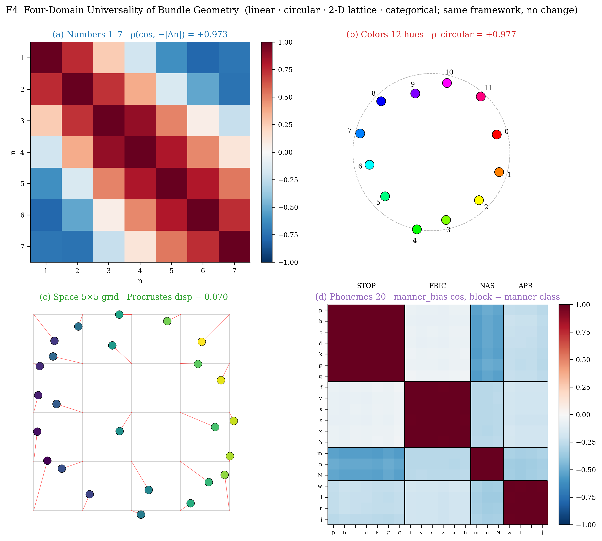

# 参数概念记忆（PCM）

[](https://github.com/zxgvfx/parametric-concept-memory/actions/workflows/ci.yml)
[](https://www.python.org/)
[](https://pytorch.org/)
[](./LICENSE)
[](./PAPER.md)

**语言**: [English](./README.md) | 简体中文

> *Concepts Collapse into Muscles — Domain-Topology-Adaptive Parametric
> Concept Memory.*
>
> 概念坍缩为肌肉：一种随领域拓扑自适应的参数概念记忆框架，以及
> 一个面向认知科学的可证伪研究台。

## 项目简介

**Parametric Concept Memory（PCM，参数概念记忆）** 是一个把"概念"
直接做成可训练参数对象的框架。传统可解释性通常会问："哪个神经元
表示概念 *X*？" PCM 换了一个问法：让每个 `ConceptNode` 自己拥有
一个多 facet 的 `ParamBundle`，再让任务模块（本文称为 "muscle"，
即肌肉）在需要时通过 `collapse()` 去消费这些参数。

这样一来，归因不再是事后推断，而是图结构里的一个一等事实：
某个概念的某个 facet 被哪些任务使用过，可以直接查看
`bundle.consumed_by[facet]`。换句话说，"概念属于哪里"从一个解释学
问题，变成了一个可查询的数据结构问题。

在四领域实证主体（数字 / 颜色 / 空间 / 音素）之上，PCM 还提供：

- **Tier-G sleep abstraction 子系统**，含七条可证伪不变量
  G1–G7（详见 `pcm/sleep.py` 与
  `docs/PCM_TIER_G_SLEEP_ABSTRACTION.md`）；
- **A / B / C / D / B+C+D 五条件因果消融协议**，对应人类三色觉
  literature 的三层因果（生物先验 / 生态统计 / 任务驱动），
  让任何"候选表征基元 *Y* 是否需要外部先验"的认知科学问题都
  可以被精确切片测试。

完整论文见 [`PAPER.md`](./PAPER.md)（英文）和
[`PAPER.zh-CN.md`](./PAPER.zh-CN.md)（中文，本仓库权威版本）。
2700 词的英文短文版本（用于 *Trends in Cognitive Sciences*
Forum / *Cognitive Science* short report）见
[`docs/SHORT_REPORT_EN.md`](./docs/SHORT_REPORT_EN.md)。
十二张论文级图表见 [`docs/figures/`](./docs/figures/)。



## 最新进展 — PCM v2 里程碑（2026 年 5 月）

跨 9 个 finding 的中期成果（F40–F49 提交，详见
`git log --oneline | head -30`）。三个亮点：

* **RPE 完全打破 §7.5-space `mixed_OOD = 0.000` 天花板** ——
  这是一年来 v1 任何 D-head 变体都无法突破的瓶颈。
  `pcm.dual_channel.RelativePositionEmbedding` 在 4 个 PCM 域
  （空间 / 颜色 / 音素 / 数字）将 OOD 准确率拉到 0.96 – 1.00 ±
  0.02，5 seeds — 同一个 API，三次 `ranges` 调整。诊断链
  （concat → trained attr → oracle attr → RPE）见
  [`docs/SHORT_REPORT_2026_S1_S6.md`](./docs/SHORT_REPORT_2026_S1_S6.md)。

* **归纳偏置必须人为施加（可证伪形式）**。F45 / F46 显示
  learned attention gate 在所有奖励强度下都停在 λ ≈ 0.98；只有
  显式 L1 惩罚（β = 0.1）才能让 gate 关闭到 λ_final ≈ 0.002。
  5 配置 × 5 种子的证据见
  [`docs/SHORT_REPORT_2026_S1_S6.md §V3-RPE`](./docs/SHORT_REPORT_2026_S1_S6.md)。

* **PCM v2 双通道编码**。概念现在分解为 `(slot, attr)` 对，
  前者支持 Tier-G 聚类，后者支持 contrastive + arithmetic +
  successor 损失（数字域 V1、V2 invariants 均为 1.000 ± 0.000）。
  完整设计见
  [`docs/PCM_V2_DUAL_CHANNEL_DESIGN.md`](./docs/PCM_V2_DUAL_CHANNEL_DESIGN.md)，
  五行升级配方见
  [`docs/PCM_V2_MIGRATION_GUIDE.md`](./docs/PCM_V2_MIGRATION_GUIDE.md)。

公共 API 新增（107 / 107 测试通过）：
- `pcm.dual_channel.{register_dual_channel_facet, collapse_dual_channel,
  RelativePositionEmbedding, info_nce_loss, arithmetic_consistency_loss,
  successor_consistency_loss, spread_regularizer, pair_attention_logits}`
- `pcm.heads.{DualChannelPairHead, SlotIdentityAuxHead, pair_collapse_and_forward}`
- `pcm.sleep.run_dual_phase_sleep`（S1 NREM 双相睡眠）+ G8a/b/c 不变量

## 核心结论

| # | 结论 | 证据 | 章节 |
|---|---|---|---|
| 1 | 归因是查字典，不是事后推断 | 7 个数 toy 上 H1-H4 全部 100% 通过 | §4.2 |
| 2 | Bundle 几何会贴合任务拓扑 | 数字 ρ = 0.991；颜色 ρ_circ = 0.977；空间 ρ_L1 = 0.860；音素 cos gap +1.2 到 +2.0 | §4–§6.5 |
| 3 | 跨 muscle 对齐由 facet 级代数兼容性决定 | 同代数对齐 (p = 0.003, 0.016)；不兼容代数 null (p = 0.77)；正交类别 null | §6.4 |
| 4 | Bundle 是概念语义身份的因果载体 | 训练后 bundle swap 触发精准 double dissociation，零 seed 方差 | §8 + 附录 B |
| 5 | PCM 给几何涌现，不自动给算法涌现 | base-10 不会自发涌现 (spike₁₀ ≈ 0.001) | §7 |
| 6 | **Tier-G sleep abstraction 在 4 域上严格安全**（无任务退化），并在难度匹配的非饱和域上 Pareto-better | F9：number 域 ΔOOD = +0.018；颜色 ρ-std 缩到 38% | §6.6 |
| 7 | **PCM 不会自发涌现 perceptual primaries**（24 seed 颜色环旋转分析；RYB 0/24 命中） | F11 §6.7 | §6.7 |
| 8 | **三层因果协议能驱动 RGB-aligned anchors**；cyclic 任务下 D（任务驱动）主导 | F11 §6.8：red-wedge 0.62 → 1.00（8/8 seed） | §6.8 |
| 9 | **三层因果协议反转 §7 base-10 negative**；D 让 spike₁₀ 翻倍（×2.3），units_gap 符号翻转，purity 0.876 | F12 §7.4：5 cond × 8 seed | §7.4 |
| 10 | **长度外推有清晰的架构上限**（D91/D92）：A/B/C 严格 chance，D/BCD 仅 +1.1 pp；颜色 hue holdout 25/25 严格 0.000 | F13/F14 §7.5 / §7.5-color | §7.5 |
| 11 | **音素跨语言迁移 B-dominant**（articulator centroid 单独 V/M/P transfer 1.000 / 0.943 / 0.771）；揭示**任务对称群 × dominant-layer 原则**：cyclic/translational 任务需 D，orthogonal-categorical 任务可由 B 单独承担 | F15 §6.9：5 cond × 5 seed | §6.9 |

## 仓库结构

```text
pcm/                       核心框架
├── concept_graph/         ConceptGraph + ConceptNode（已模块化）
├── param_bundle/          ParamBundle + ContextualizedConcept
├── heads/                 任务 muscle/head + Tier-D cook 层
├── sleep.py               Tier-G sleep abstraction（G1-G7 不变量）
├── gate.py                Tier-B slot gates
├── peer.py                Tier-C peer discovery
├── graph_eval.py          GraphEvaluator（cookable subgraph 执行器）
└── dna_ops.py             DNA op registry（concept.codebook_lookup 等）

experiments/               论文复现 + ablation 入口
├── color_concept_study/   §5 颜色研究
├── space_concept_study/   §6.2 空间研究
├── phoneme_concept_study/ §6.3 音素研究
├── counterfactual_swap_study/  附录 B 因果 swap
├── purity_audit/          §4.4 归因审计
├── render_paper_figures/  F2-F8 + F9 + F11-F15 渲染器
├── quad_study.py          §4.5 四运算 + Tier-G 接入
├── number_decimal_priors.py   §7.4：decimal cones + LastDigitHead
├── phoneme_transfer_priors.py §6.9：articulator cones + MinimalPairHead
├── sleep_ablation.py             §6.6 V2/V3 ablation
├── sleep_ablation_four_domain.py §6.6 四域 × 5-seed 安全性
├── sleep_color_primaries.py      §6.8 颜色 5-cond × 8-seed
├── sleep_inspect_color_anchors.py §6.7 24-seed 旋转分析
├── sleep_number_decimal.py       §7.4 数字 5-cond × 8-seed
├── sleep_number_extrapolate.py   §7.5 长度 OOD ceiling
├── sleep_color_holdout.py        §7.5-color hue holdout ceiling
└── sleep_phoneme_transfer.py     §6.9 跨语言迁移

tests/                     63 个单元测试（Tier-A/B/C/D + Tier-G G1-G7 + 集成）

docs/
├── figures/               F2-F8 + F9, F11, F12, F13, F14, F15
├── PCM_TIER_G_SLEEP_ABSTRACTION.md  Tier-G 设计文档
└── SHORT_REPORT_EN.md     英文短文（TICS Forum / Cog-Sci 投稿）

PAPER.md / PAPER.zh-CN.md  完整论文（英文 / 中文）
CHANGELOG.md               D91-D96 变更记录与文献映射
```

## 安装

需要 Python 3.10+ 和可用的 PyTorch 环境（CPU / CUDA 均可）。

```bash
git clone https://github.com/zxgvfx/parametric-concept-memory.git
cd parametric-concept-memory
pip install -r requirements.txt

# 或安装为可导入的开发包
pip install -e .
```

依赖包括：`torch`、`numpy`、`scipy`、`scikit-learn`、`matplotlib`。

## 快速查看框架

```python
from pcm import ConceptGraph

cg = ConceptGraph(feat_dim=128)
for n in range(1, 8):
    cg.register_concept(
        node_id=f"concept:ans:{n}",
        label=f"ANS_{n}",
        scope="BASE",
        provenance=f"smoke:n={n}",
    )

c = cg.concepts["concept:ans:3"]
cc = c.collapse(
    caller="AddHead",
    facet="arithmetic_bias",
    shape=(64,),
    tick=0,
    init="normal_small",
)

print(cc.as_tensor().shape)  # torch.Size([64])
print(cg.concepts["concept:ans:3"].bundle.consumed_by)
# {'arithmetic_bias': {'AddHead'}}
```

## 复现实验

完整四领域复现实验在单张 RTX 4090 上约 25 分钟完成；除 `N = 100`
数值实验外，CPU 上也可在较短时间内运行。

```bash
# 数字：线性领域、归因、H5/H5' 测试
python -m experiments.robustness_study \
    --encoder-ckpt outputs/ans_encoder/final.pt --n-seeds 10

# 数字规模实验
python -m experiments.scale_study --n-seeds 3

# 颜色：圆形拓扑
python -m experiments.color_concept_study --n-seeds 5

# 空间：2-D 网格
python -m experiments.space_concept_study --n-seeds 3

# 音素：离散类别拓扑
python -m experiments.phoneme_concept_study --n-seeds 3

# 负结果：纯 base-10 不会自发涌现
python -m experiments.emergent_base10_study --scan 50 100 --n-seeds 3

# 因果实验：训练后 bundle swap
python -m experiments.counterfactual_swap_study --n-seeds 3
```

### Tier-G + 三层因果消融实验

支持论文 §6.6 / §6.7 / §6.8 / §6.9 / §7.4 / §7.5 / §7.5-color
的六个额外实验（单 GPU 上累计约 1 小时）：

```bash
# §6.6 — 4 域 Tier-G 安全性（5 seed × 4 domain × A/C 对照）
python -m experiments.sleep_ablation_four_domain --n-seeds 5 \
    --out outputs/sleep_ablation_4domain

# §6.7 — 颜色环旋转分析（sleep 不会自发产生 RGB；24 seed × k ∈ {3,4,6}）
python -m experiments.sleep_inspect_color_anchors --k 3 --n-seeds 8
python -m experiments.sleep_inspect_color_anchors --k 4 --n-seeds 8
python -m experiments.sleep_inspect_color_anchors --k 6 --n-seeds 8

# §6.8 — 颜色域 5 条件 × 8 seed 三层因果消融
python -m experiments.sleep_color_primaries --n-seeds 8 \
    --out outputs/primaries_5cond_8seed

# §6.9 — 音素跨语言迁移（B-dominant 验证）
python -m experiments.sleep_phoneme_transfer --n-seeds 5 \
    --n-target 7 --out outputs/phoneme_transfer_5seed

# §7.4 — 数字 base-10 反转（D 主导：spike_10 +0.29 → +0.67）
python -m experiments.sleep_number_decimal --n-seeds 8 \
    --out outputs/decimal_5cond_8seed

# §7.5 — 长度外推 ceiling（input-side）
python -m experiments.sleep_number_extrapolate --N-train 30 --N-total 100 \
    --n-seeds 5 --out outputs/extrap_30_100_5seed

# §7.5-color — hue holdout ceiling（output-side；25/25 严格 0.000）
python -m experiments.sleep_color_holdout --holdout-hue 5 --n-seeds 5 \
    --out outputs/color_holdout_h5_5seed
```

### 重新生成图表

F2 / F4 / F5 / F6 / F7 / F8 共用一个入口脚本（约 3 分钟）；
F9 / F11–F15 各自有独立 renderer（每个 < 10 秒，无需重训）：

```bash
# 原 4 域图表
python -m experiments.render_paper_figures
python -m experiments.render_paper_figures --only F4 F7

# Tier-G + 三层因果新图表
python -m experiments.render_paper_figures.F9_sleep_four_domain
python -m experiments.render_paper_figures.F11_color_primaries
python -m experiments.render_paper_figures.F12_number_decimal
python -m experiments.render_paper_figures.F13_number_extrapolate
python -m experiments.render_paper_figures.F14_color_holdout
python -m experiments.render_paper_figures.F15_phoneme_transfer
```

## PCM 作为可证伪的认知科学研究台

除了四领域实证，PCM 提供了一个方法论上明确的消融协议，用于回答
"某个候选表征基元 *Y* 是否需要外部先验，还是会从一般性学习中
自发出现"——详见
[`docs/SHORT_REPORT_EN.md`](./docs/SHORT_REPORT_EN.md)
（2700 词，对标 *Trends in Cognitive Sciences* Forum 与
*Cognitive Science* short report）。

协议是 **A / B / C / D / B+C+D** 五条件模板，对应人类三色觉
literature 的三层因果（Stockman & Sharpe 2000；Jacobs 2009；
Conway et al. 2007）：

- **A** baseline：随机正交 centroid，均匀采样，无辅助 head；
  纯对称任务。
- **B** 生物先验：例如颜色域的 LMS-cone-like centroid，数字域
  的 decimal cone centroid，音素域的 articulator cones。
- **C** 生态统计：非均匀采样，加权任务相关输入分布。
- **D** 任务驱动非对称性：辅助 head 把一小部分输入挑出来作为
  行为相关（颜色 ripe-fruit head；数字 last-digit head；音素
  minimal-pair head）。
- **B+C+D**：三层叠加。

跨颜色（§6.7 / §6.8）、数字（§7 / §7.4 / §7.5）与音素（§6.9）
三个域，协议一致地：

1. **反驳** 在对称任务下 perceptual primaries 自发涌现
   （颜色 RGB / RYB 命中数严格等于 strict-equidistant 数；
   24 seed 中 RYB 0 次命中；5 seed 数字 spike₁₀ ≈ 0.001）。
2. **支持** 先验驱动的涌现：BCD 在颜色上达成 red-wedge 1.00，
   在数字上达成 spike₁₀ +0.67，在音素上达成 V/M/P transfer
   0.97 / 0.77 / 0.71。
3. **预测** 哪一层 dominant：cyclic / translational 任务需要
   D（颜色、数字）；orthogonal-categorical 任务则 B 单独
   即可（音素）。
4. **刻画** 干净的架构 ceiling：input-side（length-OOD-100 =
   chance + 1.1 pp）与 output-side（hue-5 holdout = 25/25 严格
   0.000）。

## 与相关工作的区别

PCM 位于概念瓶颈模型、超网络、外部记忆、机制可解释性和多任务表征
学习的交叉处，但它不是其中任何一种：

| 方向 | 常见做法 | PCM 的不同点 |
|---|---|---|
| 概念瓶颈模型 | 概念是层中激活或标签 | 概念是一等图节点，并拥有参数 |
| 超网络 / fast weights | 根据上下文生成权重 | bundle 直接存储权重，不通过生成器 MLP |
| 外部 / episodic memory | 取回向量或 key-value | 记忆本身就是 `nn.Parameter` |
| 机制可解释性 / SAE | 事后从激活中发现特征 | 先构造概念，再检验几何是否涌现 |
| 多任务表征学习 | 关注共享表征带宽 | PCM 检验 facet 级代数兼容性 |

## 引用

如果你使用 PCM 或相关结果，请引用：

```bibtex
@misc{zhang2026pcm,
  title        = {Concepts Collapse into Muscles: Domain-Topology-Adaptive
                  Parametric Concept Memory},
  author       = {Zhang, Xugang},
  year         = {2026},
  howpublished = {\url{https://github.com/zxgvfx/parametric-concept-memory}},
  note         = {Framework + 4-domain empirical study; MIT licensed},
}
```

## 许可证

- 代码（`pcm/`、`experiments/`、`tests/`、`outputs/ans_encoder/`）使用
  MIT 许可证。
- 论文与图表（`PAPER.md`、`submission/`、`docs/`）使用 CC BY 4.0。
