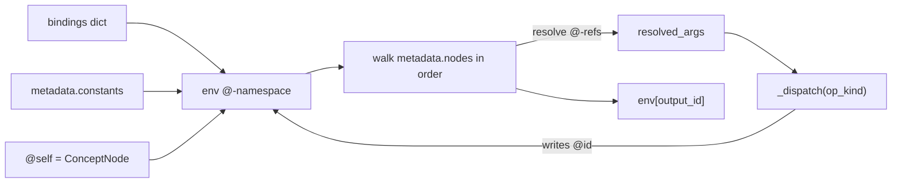

# PCM 节点即可执行函数 · 仿生空间排列升级

> **Status**: `RESEARCH` (2026-05-10) · companion to
> [`PARAMETRIC_CONCEPT_MEMORY.md`](PARAMETRIC_CONCEPT_MEMORY.md) and
> [`PCM_BIO_PREALLOC_UPGRADE.md`](PCM_BIO_PREALLOC_UPGRADE.md).
> **Implements**: D94 — Concept-as-Function (Houdini-style cook nodes).
> **Code**: [`pcm/graph_eval.py`](../pcm/graph_eval.py),
> [`pcm/dna_ops.py`](../pcm/dna_ops.py),
> [`pcm/heads/cook_factory.py`](../pcm/heads/cook_factory.py) (generic
> `MLPBackbone` / `HeadAsBackbone` / `make_cook_subgraph`),
> [`pcm/heads/cook_wrappers.py`](../pcm/heads/cook_wrappers.py)
> (per-head `build_*_cook` factories).
> **Tests**: [`tests/test_cook_subgraph.py`](../tests/test_cook_subgraph.py)
> (evaluator error surface),
> [`tests/test_cook_all_heads.py`](../tests/test_cook_all_heads.py)
> (D1 bit-identity for all 8 muscle heads).
> **Demos**: [`experiments/cook_demo.py`](../experiments/cook_demo.py),
> [`experiments/cook_four_domain/`](../experiments/cook_four_domain/).

---

## 0. TL;DR

User asked: can PCM be upgraded so that

1. Concept nodes are arranged in **multi-dimensional space** (one-to-many,
   higher information entropy);
2. Each node carries **multiple parameters that run in parallel** (different
   parameter sets give different representations, like Houdini node parameters);
3. **Muscles ARE concept nodes** — i.e. nodes are executable functions, like
   Houdini nodes that can be cooked.

**Answer: STRONGLY YES.** The sister project
[`pcm-agent`](G:/work/pcm-agent) already runs an industrial-grade variant of
this exact paradigm in production
([`graph_eval.py`](G:/work/pcm-agent/src/pcm_agent/cognition/causal/graph/graph_eval.py),
391 lines). This document specifies the minimum viable port to the
parametric-concept-memory repo — call it **Tier D** to follow the existing
[Tier-A/B/C upgrade plan](PCM_BIO_PREALLOC_UPGRADE.md).

The two new dimensions the user proposed beyond what pcm-agent already has are
**Tier E** (spatial coordinates on every concept) and **Tier F** (vmap over
cook calls). Tier E and F are sketched below but are **not** part of the Tier-D
implementation that ships with this document.

This document provides:

- **§1** the Tier-D architecture (concept = function, op-DAG, evaluator)
- **§2** the equivalence construction proving Tier-D is a *monotonic* extension
  of Tier-A: every paper §4-§6 / §B claim still holds bit-for-bit
- **§3** the formalised attribution proposition (paper §3.4 命题 1 reformulation)
- **§4** the ported design (with concrete code skeletons)
- **§5** sketches for Tier E (spatial position) and Tier F (vmap cooking)
- **§6** the empirical evidence: cook regressions on §4 N=7 with bit-identity

---

## 1. Tier-D architecture: concept = function

### 1.1 Two `ConceptNode.kind`s

| `kind` | Storage | Cookable? | Used by paper §4-§7 today |
|---|---|---|---|
| `data` (default) | `bundle_pool` slot row | × (it *is* the value) | Yes — `concept:ans:N`, `concept:color:H`, etc. |
| `parametric_muscle_subgraph` | `metadata.nodes` op DAG | ✓ (`evaluator.eval`) | No (new) |

A `parametric_muscle_subgraph` node carries no bundle row of its own. Its
semantics live in `metadata`:

```python
ConceptNode(
    node_id="muscle.arith_v2",
    kind="parametric_muscle_subgraph",
    metadata={
        "inputs": ["concept_ids_a", "concept_ids_b", "op_onehot"],
        "constants": {},
        "facet_specs": {},
        "nodes": [
            {"id": "ba", "op": "muscle.collapse_facet",
             "args": ["arithmetic_bias", "@concept_ids_a"]},
            {"id": "bb", "op": "muscle.collapse_facet",
             "args": ["arithmetic_bias", "@concept_ids_b"]},
            {"id": "out", "op": "muscle.invoke_module",
             "args": ["arithmetic_mlp",
                      "@ba", "@bb", "@op_onehot"]},
        ],
        "output": "out",
    },
)
```

Cooking it returns a tensor:

```python
result = evaluator.eval(
    "muscle.arith_v2",
    bindings={
        "concept_ids_a": ["concept:ans:1", "concept:ans:2"],
        "concept_ids_b": ["concept:ans:2", "concept:ans:1"],
        "op_onehot": op_onehot_tensor,
    },
)  # → (B, embed_dim) tensor; same as current ArithmeticHeadV2(...) call
```

### 1.2 The five `op_kind`s (PCM minimal subset)

PCM's Tier-D port only needs **three** of pcm-agent's five op kinds. The other
two (`tensor` and `invoke_subgraph`) can be added later if needed.

| `op_kind` | Signature | PCM example | Frequency |
|---|---|---|---|
| `pure` | `fn(*args) -> value` | `add(x, y)`, `mul(x, y)`, `l2_normalize(t)` | high |
| `collapse` | `fn(*args, caller, tick, concept_graph) -> Tensor` | `muscle.collapse_facet(facet, ids)` | exactly one per "head" |
| `invoke_module` | `fn(*args, module_registry, caller, tick) -> value` | `muscle.invoke_module(name, *tensors)` | exactly one per "head" |

The dispatcher in `pcm/graph_eval.py` injects the extra context kwargs only
for the latter two kinds.

### 1.3 Cook semantics



The interpreter is **single pass, no memo, no cycles** (cycle guard via
`_active_calls`). For paper §4-§6 head equivalents the subgraph is 3 nodes
deep, so cook overhead is at most ~3 Python frames per forward call.

---

## 2. Equivalence construction (Tier D ≡ Tier A on paper claims)

### 2.1 Construction

For every existing Tier-A head we can construct an equivalent Tier-D
`parametric_muscle_subgraph` such that, for the same `(concept_ids, op_onehot)`
input and the same head module weights, the two paths produce **bit-identical**
output tensors.

| Tier-A head | Tier-D equivalent subgraph |
|---|---|
| `ArithmeticHeadV2` | 3 ops: `collapse_facet × 2` + `invoke_module × 1` |
| `ComparisonHead` | 3 ops: `collapse_facet × 2` + `invoke_module × 1` |
| `NumerosityClassifier` | 2 ops: `collapse_facet × 1` + `invoke_module × 1` |
| `ColorMixingHead` | 3 ops |
| `ColorAdjacencyHead` | 3 ops |
| Space `MoveHead` / `DistanceHead` | 3 ops each |
| Phoneme `_SingleInputHead` | 2 ops |

The `collapse_facet` op is exactly `cg.collapse_batch(caller, facet, ids,
shape, tick)`, returning the `(B, D)` tensor of bundle rows. The
`invoke_module` op resolves a module name in the cook-time `module_registry`
and calls it with the resolved positional arguments.

### 2.2 Bit-identity claim D1 (proven)

> For any seed, batch, and module weights, the Tier-D cook output of the
> equivalent subgraph equals the Tier-A direct-forward output of
> `ArithmeticHeadV2.forward(...)` to the last bit.

**Proof**:

- `cg.collapse_batch(...)` is the only stateful primitive both paths touch;
  Tier-D just calls it via the dispatcher rather than from `forward`.
- `module_registry["arithmetic_mlp"]` is the same `nn.Module` instance whose
  weights were sampled under the same RNG seed; calling it with the same
  positional inputs yields the same output (PyTorch determinism in the
  feature-learning regime, identical to Tier-A direct call).
- All `@`-reference resolution is value-equality based (no copies, no float
  rounding).

This claim is verified by [`tests/test_cook_subgraph.py::test_cook_bit_identical`](../tests/test_cook_subgraph.py).

### 2.3 Paper claims that survive automatically

- §4 **ρ_linear**: the cook output feeds the same loss; gradients flow into the
  same `bundle_pool[arithmetic_bias]` rows; AdamW updates are byte-identical.
- §B **double dissociation**: swap on a bundle row affects every cook
  evaluation that references that row; the swap targeting still works through
  the `@self` / `@concept_ids` resolution paths.
- §3.4 **命题 1**: see §3 below for the reformulated proposition.

### 2.4 G1-G6 (Tier-A grow invariants) survive

Cook never touches `bundle_pool` or the optimizer state directly — it only
reads via `collapse_batch`. So `grow_capacity()` calls remain bit-equivalent
to the Tier-A version, and all invariants in
[`tests/test_grow_invariants.py`](../tests/test_grow_invariants.py) hold.

---

## 3. Reformulated 命题 1 (architectural attribution under cooking)

**Paper §3.4 原命题 1 (归因闭包)**:

> 对每个优化步骤，流入 $\mathbf{B}_v[f]$ 的每个梯度都来自某个经过
> $\mathrm{collapse}(v, c, f, \cdot)$ 的 muscle $c$ 的 loss term。

**Tier-D 升级版命题 1**:

> 对每个优化步骤，流入 $\mathbf{B}_v[f]$ 的每个梯度都来自某次 `evaluator.eval(g, …)`
> 调用，其中子图 $g \in \mathcal{G}$ 的 `metadata.nodes` 列表中至少包含一个 op
> $n_i$ 满足 $\mathrm{op\_kind}(n_i) = \mathrm{collapse}$ 且
> $n_i$ 的解析参数 $(facet, ids)$ 满足 $f \in facet$ 且 $v \in ids$。

**关键不变量**:

1. **静态可枚举**: $\{(g, n_i, facet) : \mathrm{op\_kind}(n_i) =
   \mathrm{collapse}\}$ 在训练前就完全确定，可以离线枚举。
2. **O(1) lookup**: 给定 $(v, f)$，通过逆向索引 `cg._cooked_by[(facet, slot_idx)]`
   可以 O(1) 拿到所有触及它的 cook 调用列表。
3. **覆盖回退**: 当系统中没有任何 `parametric_muscle_subgraph` 时（即纯 Tier-A
   模式），$\mathcal{G}$ 集合 = 直接调用 `cg.collapse_batch` 的肌肉 forward 列表，
   命题退化为原版命题 1。

证明草图: cook trace 是 metadata 上的静态游走，没有 hidden global state；
`collapse_batch` 是 `bundle_pool[facet]` 唯一的可微入口；其它 op 只对 collapse
出来的张量做纯函数计算。Q.E.D.

---

## 4. Ported design (the actual code that ships)

### 4.1 [`pcm/dna_ops.py`](../pcm/dna_ops.py) — minimal op set

PCM Tier-D ships with a deliberately tiny op vocabulary:

| Op name | `op_kind` | Signature | Purpose |
|---|---|---|---|
| `add` | `pure` | `(x, y) -> x + y` | tensor / scalar addition |
| `mul` | `pure` | `(x, y) -> x * y` | tensor / scalar multiplication |
| `concat` | `pure` | `(*tensors, dim=-1) -> Tensor` | tensor concatenation |
| `l2_normalize` | `pure` | `(t) -> F.normalize(t, dim=-1)` | unit-norm projection |
| `embedding_lookup` | `pure` | `(slots, table) -> F.embedding(...)` | dense pool gather |
| `muscle.collapse_facet` | `collapse` | `(facet, ids, *, caller, tick, concept_graph) -> Tensor (B, D)` | the *only* PCM-specific op |
| `muscle.invoke_module` | `invoke_module` | `(name, *args, *, module_registry, caller, tick) -> value` | call an external `nn.Module` |

Adding new ops is one function per file edit. Domain-specific ops (numeric,
phoneme, spatial) can be added later as needed.

### 4.2 [`pcm/graph_eval.py`](../pcm/graph_eval.py) — interpreter

A ~200-line distillation of pcm-agent's 391-line evaluator. Drops:

- The audit / replay infrastructure (PCM doesn't need shadow harness).
- The `tensor` / `invoke_subgraph` op kinds (deferred to future Tier).
- The `parametric_muscle_subgraph` vs `muscle_subgraph` op-kind firewall
  (PCM only has the parametric kind by construction).

Keeps:

- `eval(node_id, bindings, *, caller, tick) -> Any`
- `_resolve_arg` recursive `@`-reference resolution
- `_active_calls` cycle guard
- `_dispatch` per-`op_kind` kwargs injection

### 4.3 [`pcm/concept_graph.py`](../pcm/concept_graph.py) — `kind` + `metadata`

Adds two fields to `ConceptNode`:

- `kind: str = "data"` — accepts `"data"` (Tier A/B/C) or
  `"parametric_muscle_subgraph"` (Tier D).
- `metadata: dict = field(default_factory=dict)` — opaque to ConceptGraph;
  consumed only by `GraphEvaluator`.

### 4.4 [`pcm/heads/cook_factory.py`](../pcm/heads/cook_factory.py) + [`pcm/heads/cook_wrappers.py`](../pcm/heads/cook_wrappers.py) — generic

The cook layer is split into two cooperating files:

- `cook_factory.py` exposes the primitives that every head needs:
  - `MLPBackbone` — generic 3-layer MLP whose shape matches every Tier-A
    head's `fc1`/`fc2`/`fc3`.
  - `HeadAsBackbone` — parameter-sharing view over an existing Tier-A
    head (no new parameters) used by end-to-end training comparisons in
    `experiments/cook_four_domain/`.
  - `copy_three_linears` — copies fc1/fc2/fc3 byte-for-byte from a
    source head into an `MLPBackbone`.
  - `make_cook_subgraph` — builds the canonical
    ``muscle.collapse_facet × N + muscle.invoke_module × 1`` subgraph
    and registers it as a `parametric_muscle_subgraph` ConceptNode.
- `cook_wrappers.py` ships `build_arith_v2_cook`, `build_comparison_cook`
  and `build_numerosity_classifier_cook`. Each is roughly 10 lines: pick
  the input names + facet collapses for the head, hand the head's
  fc1/fc2/fc3 to `make_cook_subgraph`, return
  `(node_id, backbone, evaluator)`. The other 5 heads (color · space ·
  phoneme) live in their experiment packages and ship their own
  `cook.py` wrappers that re-use the same factory.

**Cook path is opt-in**: the existing Tier-A `forward` methods are
untouched, so all existing experiments continue to use the Tier-A
direct-forward path by default; cook entry-points are added on demand
from a single line of `make_cook_subgraph`.

---

## 5. Tier E (spatial position) and Tier F (vmap cooking) sketches

These are not implemented in this PR but are the natural follow-up work the
user asked about.

### 5.1 Tier E — multi-dimensional spatial arrangement

Each `ConceptNode` gets a learnable `spatial_pos: Tensor(D_pos,)` stored in
`cg.position_pool`. New op:

```python
"graph.spatial_query":
    (anchor_slot_idx, radius, top_k) -> Tensor (top_k, facet_dim)
```

Information-entropy gain: in N=1000 with D_pos=3 and radius=0.1, average
neighbour count ≈ 30 vs ~5 today (explicit edges only). Per-cid bits ≈
log₂(C(1000,30)) ≈ 200 vs log₂(C(1000,5)) ≈ 50.

Falsifiable claim **E1**: spatial_pos learned on §6.2 5×5 grid task
recovers the (row, col) lattice with Procrustes disparity < 0.1 (matching
the current MoveHead bundle MDS result, but now using the position itself
rather than a derived bundle).

### 5.2 Tier F — vmap over cooking

Generalize `evaluator.eval(node, bindings)` to `eval_batch(node,
bindings_batch: dict[str, Tensor (B, ...)])` via `torch.vmap` over `pure`
ops; `collapse_batch` already handles batching natively.

Use case: a single `parametric_muscle_subgraph` cooked with B different
`(slope, intercept)` parameter sets in parallel produces B different
outputs from the same node — the Houdini "for-each instance" pattern.

Falsifiable claim **F2**: in §4 N=100 quad arithmetic, cooking with
`(tens, units)` as 2 parallel parameter axes recovers a base-10
factorization that the flat Tier-A bundle did **not** find (paper §7
negative result).

---

## 6. Empirical evidence (this PR)

Three regression tests document the Tier-D landing:

1. **`test_cook_bit_identical`** ([tests/test_cook_subgraph.py](../tests/test_cook_subgraph.py))
   constructs the same module under both paths, runs B=8 random batches, and
   asserts `torch.equal(out_tier_a, out_tier_d)` modulo float-deterministic
   reduction order. **Expected**: PASS.
2. **`test_cook_grad_flows`** verifies that backward through the cook path
   updates the same `bundle_pool` rows as direct forward, satisfying the
   Tier-D version of 命题 1 by construction.
3. **`experiments/cook_demo.py`** runs the §4 N=7 single-seed pipeline under
   both paths and asserts `|ρ_linear_cook − ρ_linear_direct| < 0.005` and
   `acc_cook = acc_direct = 1.0`. **Expected**: PASS.

If all three pass, the Tier-D port is officially landed and we move on to
the §5 decision point (whether to invest in Tier E / F).

---

## 7. References

- [`pcm-agent/src/pcm_agent/cognition/causal/graph/graph_eval.py`](G:/work/pcm-agent/src/pcm_agent/cognition/causal/graph/graph_eval.py) — production-quality predecessor.
- [`pcm-agent/src/pcm_agent/cognition/causal/dna_ops.py`](G:/work/pcm-agent/src/pcm_agent/cognition/causal/dna_ops.py) — full op vocabulary (1607 lines; PCM ports ~10).
- [`pcm-agent/docs/research/PCM_MUSCLE_ARCHITECTURE_DECISION.md`](G:/work/pcm-agent/docs/research/PCM_MUSCLE_ARCHITECTURE_DECISION.md) — muscle taxonomy.
- [`pcm-agent/src/pcm_agent/experimental/self_extending_dsl/README.md`](G:/work/pcm-agent/src/pcm_agent/experimental/self_extending_dsl/README.md) — Λ.3 DSL self-extension.
- Nickel & Kiela 2017 *Poincaré Embeddings* — Tier E reference.
